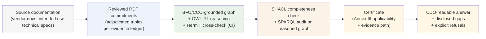

# About ARCO

A companion to [README.md](README.md). The README explains what ARCO is and how to run it. This document explains why it exists, what choices it makes and why, how to verify any of its claims yourself, and what it is honestly not for. It is meant to be read by both technical and non-technical readers. Where a section needs technical depth, the depth is grounded in named files in this repository so the claim can be checked.

If you are reading this in five minutes, the next two sections are what matters.

---

## The shorter version

ARCO is a small, deterministic pipeline that takes a structured description of an AI system and tells you, before that system is built or deployed, whether it satisfies a formal encoding of two specific EU AI Act high-risk conditions (Annex III 1(a) remote biometric identification, and 5(b) creditworthiness evaluation). The same description always produces the same answer, and every answer chains back through specific axioms to the exact components, capabilities, intended uses, and affected role categories that triggered it.

The point of ARCO is not the two categories. The point is to demonstrate that this kind of pre-deployment, audit-traceable, formally grounded condition assessment is achievable using existing standards (BFO 2020, the OBO Relations Ontology, the Information Artifact Ontology, the Common Core Ontologies, OWL-RL reasoning, SHACL validation, SPARQL auditing) and that the architecture extends to other regulated domains where obligations attach to capability, structure, and role. The implementation is intentionally small. The architecture is general.

ARCO does not use a large language model anywhere in the classification path. It is not a runtime monitor, a probabilistic risk score, or a substitute for legal counsel. It is a worked example of an architecture for upstream regulatory clarity.

---

## The chain, in one diagram



Each arrow is auditable. Source documentation licenses reviewed RDF commitments through an evidence ledger (see [`docs/EVIDENCE_TO_COMMITMENT_POLICY.md`](docs/EVIDENCE_TO_COMMITMENT_POLICY.md)). The reasoned graph is verified by [`test_gate_removal.py`](03_TECHNICAL_CORE/scripts/test_gate_removal.py) (each gate is independently necessary) and by HermiT cross-check on every certificate-grade fixture in CI. The certificate's classification line and evidence path are graph-derived. The surrounding pass/fail summary fields are currently Python-composed and being moved to a graph-bound emitter (see [LIMITATIONS.md §7.5](LIMITATIONS.md) and the L4 rows of [OPEN_PROBLEMS.md](OPEN_PROBLEMS.md)). That gap is the active output-layer work.

---

## Why this exists

Most AI governance work today is **behavioral**. It asks what a deployed system does: what outputs it produces, how it behaves in red-team scenarios, what risks emerge under monitoring. Behavioral governance is necessary, but it has a structural blind spot. By the time you are observing behavior, the system already exists, the architecture is already chosen, the regulatory exposure is already real, and the remediation cost is already high.

Regulation, including the EU AI Act, increasingly classifies AI systems by **what they are intended to be used for**, not by what they happen to be doing in any particular run. Liability attaches to capability, to the role-bearers a system affects, to the processes a system is intended to realize. These are properties of the reviewed commitments about the system, not of any particular execution.

ARCO sits upstream of behavioral governance. It treats capability as something that resolves from structure: traced from the system's components, through the dispositions those components are committed to bear, through the processes the system is intended to participate in, through the role categories its scenarios are about, to the regulatory conditions those facts logically entail. If the structural prerequisites for a regulated capability are not asserted in the reviewed commitments, the capability is not entailed for regulatory purposes under those commitments. If they are asserted, the regulatory classification follows by formal inference from axioms anyone can read.

There is a thesis underneath this. Ontological identity precedes governance. You cannot govern, monitor, audit, or assure a system whose meaning was never made explicit. Most enterprise AI projects rebuild this meaning layer at every system boundary, in different vocabularies, with no formal commitment that the meaning will travel. ARCO is a small worked example of what it looks like to instead ground the meaning layer in a shared upper ontology so that classification, audit, and downstream governance can compound across systems instead of being recreated each time.

Determinism in this context is not a technical feature for its own sake. It is the mechanism by which the work can be trusted. A probabilistic score cannot be governed; the question "why this score?" has no audit-traceable answer. A logical entailment from axioms can be governed; the question "why this classification?" resolves to specific named axioms, specific facts, and a specific reasoning step that anyone can re-run.

That is the why.

---

## What ARCO is for, and what it is not for

This is a worked example of an architecture, scoped narrowly so that every claim can be defended.

**ARCO is for:**

- AI providers and developers who want regulatory classification visibility at design time, before sunk costs and deployment exposure
- Evaluators, auditors, and procurement officers who need to read a defensible reasoning chain rather than a confidence score
- Applied ontologists curious about what BFO grounding looks like when wired into a real classification pipeline
- Researchers interested in the upstream / downstream split between LLM-aided extraction and formal-ontology-based determination
- Anyone who wants to understand whether the architecture generalizes to a different regulated domain

**ARCO is not for, and will not become without explicit changes:**

- A surveillance categorization system. ARCO does not classify natural persons, behaviors, or threat categories.
- An autonomous-weapons component or targeting system.
- A behavioral profiling pipeline.
- A runtime monitor or post-deployment policy enforcer. Those are valuable; they are not what ARCO is.
- A substitute for legal counsel or for a notified-body conformity assessment.
- A productized service. There is no hosted version, no SaaS, no commercial offering.

A separate section below ("The dual-use disclosure") covers a harder version of this point: the *architecture* underneath ARCO is general-purpose, and ARCO has no technical mechanism to prevent that architecture being adapted for purposes it does not endorse. The bounded scope above is a public-claim discipline, not an architectural constraint. Disclosure is the response.

---

## How ARCO works, plainly

The repository contains, at its core: a small ontology grounded in BFO 2020 with terms drawn from RO, IAO, and CCO; a SHACL shape file for documentary completeness; a set of SPARQL audit queries; and a Python pipeline that orchestrates them. A single command runs the whole thing end-to-end and produces a certificate.

There are five architectural choices that carry the work. Each is described below in plain English, with pointers into the repo so any technical reader can verify the claim against the source.

### The reality and representation cut

ARCO is strict about what kind of thing each entity in the model is. Things that exist in the world (the system, its hardware components, the dispositions those components bear, the processes the system can realize) are modeled on the **reality** side, as BFO independent continuants, processes, and dispositions. Things that are *information about* the world (intended-use specifications, use-scenario specifications, assessment documentation, compliance determinations, regulatory text) are modeled on the **representation** side, as IAO Information Content Entities. The two are connected by the IAO `is_about` relation, never by parthood. Software is information that is realized in matter; treating it as a part of the system would be a category error and is rejected.

This discipline matters because it keeps ARCO honest about what kind of claim each axiom is making. A capability is something the configured-system bears (under reviewed commitments). A determination is something a process produces about that system. The two are different kinds of thing, and the entailment chain treats them differently.

The reality / representation cut has one important caveat that the README and [LIMITATIONS.md §3.5](LIMITATIONS.md) document explicitly: for software-configurable AI systems, the same hardware can be configured for different modes in different deployments. ARCO does not make closed-world hardware-incapability claims. The disposition assertion describes what THIS specific deployment is intended to do under its current commitments, not what hardware in isolation could theoretically do. A different deployment of the same hardware would be modeled as a separate `:System` instance with its own asserted disposition.

This cut is enforced in the design comments inside [`03_TECHNICAL_CORE/ontology/ARCO_core.ttl`](03_TECHNICAL_CORE/ontology/ARCO_core.ttl).

### Three reasoning layers, in fixed order, that do not substitute for each other

The pipeline runs three distinct reasoning layers on the same materialized graph, in fixed order, each answering a different question. They are not interchangeable, and the difference between them is load-bearing for the trust claim.

**Layer 1: OWL-RL classification.** This layer materializes logical entailments from the ontology and the asserted facts. It is the only layer that produces classifications. When a system instance satisfies the conditions of an Annex III category, the reasoner adds the membership triple to the graph. That triple is the determination. There is no separate decision step.

**Layer 2: SHACL validation.** This layer runs after classification and checks whether the documentary record supporting the determination is structurally complete. Are the assessments anchored to systems? Do intended-use specifications prescribe correctly typed processes? Is the compliance obligation specification linked to a role? SHACL passing means the supporting documentation is well-formed; it does not mean the system is high-risk. SHACL failing means a documentation gap; it does not mean the classification is wrong.

**Layer 3: SPARQL audit and flag.** This layer inspects the post-reasoning graph for specific patterns. Some queries verify that an OWL entailment did materialize (a sanity check, not a classification). Others flag conditions for human review: a derogation claim has been made, a fraud-detection exclusion may apply, regulatory alignment between provider documentation and statutory text needs attention. SPARQL queries cannot upgrade or downgrade a classification. They surface things humans should look at.

The hard rule, taken from the project's invariants: a SHACL pass does not mean a system is high-risk; a SPARQL false does not mean an OWL classification is wrong. These are different questions with different epistemic status. Confusing them, even in plain-language summaries, is the error to avoid.

### Why BFO 2020 with RO, IAO, and CCO loaded as ROBOT BOT slim modules

ARCO's upper-ontology grounding is not an aesthetic choice. It is doing concrete work.

**BFO 2020** is the second edition of Basic Formal Ontology, standardized as ISO/IEC 21838-2:2021. It provides a small set of foundational categories (continuant, process, disposition, role, object aggregate, and others) that every ARCO class specializes. It is the same ontology adopted in 2024 as a baseline standard by the chief data officers of the U.S. Department of Defense, the Office of the Director of National Intelligence, and the Chief Digital and AI Officer. It is the upper ontology used across the OBO Foundry biomedical projects, including the Gene Ontology and the Information Artifact Ontology itself. ARCO using BFO is not novel; it is following an established and credentialed pattern.

**The OBO Relations Ontology (RO), IAO, and CCO** are loaded not as full upstream files but as **slim modules extracted using ROBOT, the OBO Foundry's standard tool**, with the `--method BOT` extraction algorithm (Syntactic Locality Module Extraction, formalized 2007-2008). The seed term lists ARCO actually uses are version-controlled at `03_TECHNICAL_CORE/ontology/imports/seeds/`, and the slim modules can be regenerated reproducibly from pinned upstream releases.

This is the standard OBO Foundry / Ontology Development Kit (ODK) pattern, used by hundreds of community-managed projects. The extraction algorithm carries a formal entailment-preservation guarantee: for any axiom whose signature is contained in the seed signature, the extracted module entails the axiom if and only if the full upstream ontology does. This includes property characteristics, chain axioms, inverse-of axioms, and domain/range constraints, which ARCO's gate definitions depend on. The conventional alternative, MIREOT, does not carry this guarantee and is documented by ROBOT itself as not preserving the full set of logical entailments. For a project whose headline product is OWL reasoning correctness, BOT is the right choice on principle.

The longer rationale, with five named justifications, is in [`docs/ARCO_imports_rationale.md`](docs/ARCO_imports_rationale.md).

### The three-gate model

Each Annex III category modeled in ARCO is defined as an OWL `equivalentClass` axiom with three independently necessary gates. All three gates must hold for the entailment to fire. A gate-removal regression test ([`03_TECHNICAL_CORE/scripts/test_gate_removal.py`](03_TECHNICAL_CORE/scripts/test_gate_removal.py)) removes one gate's supporting facts at a time and confirms the entailment fails, so gate independence is an empirical claim, not just an architectural intention. (One honest disclosure: the regression test currently exercises Annex III 1(a) Sentinel only; the parallel 5(b) CreditScorer coverage is open as `OPEN_PROBLEMS L3.5` and is queued as a mechanical PR.)

**Gate 1, reality-side capability.** The system has a part that is a structural component, and that component bears a disposition of the regulated capability kind. For Annex III 1(a), the capability is biometric identification. For 5(b), it is creditworthiness evaluation. The capability classes are pairwise disjoint, so a single component cannot accidentally bear both, and a system whose only triggering capability is one cannot accidentally satisfy the gate of the other. Cross-category isolation is enforced at the ontology level.

**Gate 2, representation-side prescribed process.** An intended-use specification is about the system, and it prescribes some instance of the regulated process class. This is the directive layer (the system *is intended to* realize this process kind). The Gate 2 axiom is factored through a category-specific IUS subkind (`:RemoteBiometricIdentificationIntendedUseSpec` for 1(a); `:CreditworthinessEvaluationIntendedUseSpec` for 5(b)) whose own equivalentClass definition performs the prescribed-process type check. This factoring follows the CCO Specification family pattern.

**Gate 3, representation-side affected role.** A use-scenario specification is about the system, and it designates the regulated role universal (for both 1(a) and 5(b), the natural-person role). The role-as-universal modeling is intentional. ARCO operates at specification level, before deployment; no specific person yet bears the role for the system. The scenario specification is referring to the role *category* as a regulatory concept, not to a specific role-bearer instance, so the OWL operator used here matches identity (the named role universal) rather than type (instances of that role universal). Inverting either operator would either reintroduce a documented past bug or force fictional deployment-time instances. Each operator is the only one that correctly models what its gate is claiming.

The gate definitions live in [`03_TECHNICAL_CORE/ontology/ARCO_governance_extension.ttl`](03_TECHNICAL_CORE/ontology/ARCO_governance_extension.ttl). Each is documented in-file with a multi-paragraph rationale comment. The full diagrams and walkthrough live in [`docs/ARCO_technical_overview.md`](docs/ARCO_technical_overview.md).

### Why no large language model is in the classification path

This is a deliberate architectural commitment, not a limitation, and it is grounded in three reasons.

The first is **determinism**. The same structured input must produce the same classification, every run, on every machine, indefinitely. Large language models do not have this property: their outputs vary with sampling, temperature, weights version, prompt phrasing, and provider-side updates. A regulatory classification artifact loses its trust property the moment it depends on something non-deterministic.

The second is **auditability**. The classification chain in ARCO is fully inspectable: a TTL axiom, a reasoner step, an entailment, a materialized triple, a row in the certificate. Every link is in plain text, version-controlled, re-runnable. A large language model call is opaque by construction; even with reasoning traces, the trace is post-hoc rationalization, not a verifiable chain.

The third is **authority**. Whether a system meets the formal definition of an Annex III category is a logical question with a definite answer once the facts are known. It is not a question of natural-language understanding or judgment. The right tool for a logical question is a logical reasoner. Large language models are useful upstream for extracting facts from messy inputs (intended-use language in vendor PDFs, capability claims in marketing copy); they are wrong as the *judge* of whether the resulting facts entail high-risk classification.

The compressed form: large language models help upstream; formal ontology decides downstream.

---

## How you can verify it works

Trust in this kind of work is an empirical question, not a claim to be taken on faith. ARCO supports six independent layers of verification, all of which run automatically in CI on every change to the repository.

**One: the Sentinel-ID determinism test.** A worked-example AI system is asserted in [`03_TECHNICAL_CORE/ontology/ARCO_instances_sentinel.ttl`](03_TECHNICAL_CORE/ontology/ARCO_instances_sentinel.ttl), engineered to satisfy all three gates of Annex III 1(a). On every CI run, the pipeline confirms the OWL-RL reasoner entails Sentinel-ID's class membership, the certificate output matches expected, and HermiT (a separate reasoner described below) independently agrees. If anyone weakens an axiom, the Sentinel test fails and the change cannot merge.

**Two: the gate-independence regression test.** [`test_gate_removal.py`](03_TECHNICAL_CORE/scripts/test_gate_removal.py) removes the supporting facts for one gate at a time, runs the pipeline, and confirms the entailment fails. This is empirical proof each gate is necessary; if a gate were redundant, removing its facts would not break the classification. The test runs on every push. Honest scope: it currently covers Annex III 1(a) Sentinel only; symmetric 5(b) CreditScorer coverage is queued (`OPEN_PROBLEMS L3.5`).

**Three: an independent OWL 2 DL cross-check using HermiT.** A separate workflow, defined in [`.github/workflows/robot-validate.yml`](.github/workflows/robot-validate.yml), runs HermiT (a tableau-based OWL 2 DL reasoner from Oxford) on the merged ontology against every certificate-grade fixture (Sentinel-ID, CreditScorer, verification kiosk, equivalence decoy, both flag-test fixtures). HermiT uses a different reasoning algorithm and a richer logical profile than the production OWL-RL pipeline. When both reach the same conclusion across the fixture set, that is the strongest determination signal achievable with off-the-shelf tooling. The cross-check catches both directions of error: cases where the lighter profile would miss something, and cases where the richer profile would surface an inconsistency the lighter one ignored.

**Four: cross-category isolation tests.** A creditworthiness-only system must not be entailed as Annex III 1(a) applicable, and a biometric-only system must not be entailed as 5(b). The disjointness axioms on capability classes plus the distinct gate definitions for each category prevent contamination, and the test suite verifies this empirically.

**Five: adversarial test instances.** The repository includes [`ARCO_instances_adversarial_decoy.ttl`](03_TECHNICAL_CORE/ontology/ARCO_instances_adversarial_decoy.ttl), [`ARCO_instances_adversarial_blanknode.ttl`](03_TECHNICAL_CORE/ontology/ARCO_instances_adversarial_blanknode.ttl), and [`ARCO_instances_flag_tests.ttl`](03_TECHNICAL_CORE/ontology/ARCO_instances_flag_tests.ttl). These are designed to provoke specific failure modes: decoy patterns that look like they should classify but should not unless the reasoner does real OWL semantics (the decoy fixture types its disposition only as `:WeirdScanner`, declared `owl:equivalentClass` to `:BiometricIdentificationCapability`; if the pipeline were string matching, the decoy would fail), blank-node edge cases that can trip up reasoners, and flag-condition triggers that should produce specific FLAGGED audit outputs. They must pass on every run.

**Six: SHACL conformance on the same materialized graph.** After OWL-RL reasoning, SHACL validates that the documentary record supporting the determination is structurally complete. This confirms the surrounding evidence chain is intact, not just that a single classification triple was produced. The shape file is [`03_TECHNICAL_CORE/validation/assessment_documentation_shape.ttl`](03_TECHNICAL_CORE/validation/assessment_documentation_shape.ttl).

There is a critical honest caveat that goes with all six. Each layer proves correctness *under the axioms ARCO contains*. Whether the axioms themselves correctly capture the legal text of EU AI Act Annex III 1(a) and 5(b) is a separate human judgment that has not been performed by qualified legal counsel. ARCO is verifiably correct under its current encoding; the encoding is my careful interpretation of the regulatory text as an applied-ontology practitioner, and that interpretation has not yet been reviewed by lawyers. This is a known gap, disclosed in the next section.

---

## What ARCO is honestly not, and what it cannot do

Naming gaps openly is a credibility move, not a weakness. The set below is intentionally complete. If a serious questioner finds a gap that is not on this list, that is a real bug in the disclosure and should be added.

### Scope and modeling gaps

**Annex III coverage is two of roughly twenty-six sub-items.** The EU AI Act Annex III contains eight areas with multiple sub-items each. ARCO models 1(a) remote biometric identification and 5(b) creditworthiness evaluation. The other categories (biometric categorisation by sensitive attributes, emotion recognition, critical infrastructure, education and vocational training, employment and worker management, access to essential public services, emergency response dispatch, law enforcement, migration and border control, administration of justice and democratic processes) are not modeled in this release. The architecture extends to them; the work is content, not architecture.

**Temporal validity is not modeled.** A determination records a timestamp as a string in the certificate output. There is no BFO temporal-region modeling, no reassessment trigger, no compliance-interval tracking, no notion of "this determination is valid until the system is retrained." This was an intentional deferral because Annex III 1(a) and 5(b) entailment does not require temporal reasoning. Adding it is a future precision upgrade.

**Legal review of the gate encoding has not been performed.** ARCO's three-gate model is my interpretation, as an applied-ontology practitioner, of the Annex III statutory text. A qualified EU AI Act lawyer has not reviewed the encoding to confirm the gates correctly capture the legal intent. The structural correctness of the entailment is verifiable; the legal correctness of the interpretation is not yet validated.

**Output composition layer has known integrity gaps.** The certificate's classification line and evidence path are graph-derived, but several surrounding pass/fail summary fields are currently composed by Python rather than bound from named SPARQL queries against the reasoned graph. An output-provenance contract has been drafted (`03_TECHNICAL_CORE/scripts/output_manifest_v2.yaml`) with a draft enforcement test (`test_output_provenance.py`) that names the synthesis patterns to remove. PRs B-E in [`OPEN_PROBLEMS.md`](OPEN_PROBLEMS.md) close the gap. Until then, treat the certificate as classification-line entailed, evidence path graph-derived, surrounding summary fields known-imprecise. See [LIMITATIONS.md §7.5](LIMITATIONS.md).

**Derogation claims are flagged, not evaluated.** EU AI Act Article 6(3) provides a derogation for systems that "do not pose a significant risk of harm." ARCO has a SPARQL flag that surfaces a provider-asserted derogation claim for human legal review. ARCO cannot evaluate whether the claim is legally valid; that requires human judgment.

**Real-time vs post RBI Article 5 routing is not modeled.** Annex III 1(a) covers remote biometric identification systems generally. Article 5(1)(h) prohibits a real-time, publicly accessible spaces, law enforcement subset under narrow exceptions. ARCO does not model the distinction; downstream users must treat that as a coverage gap.

**The 5(b) fraud-detection exclusion is not modeled as a negation gate.** Article 5(b) excludes AI systems used for detecting financial fraud from the high-risk category. ARCO includes a `FraudDetectionProcess` class and an audit flag that surfaces fraud-detection candidacy for human review, but the exclusion is not expressed as a logical negation in the OWL-RL profile. A fraud-detection system that also evaluates creditworthiness could produce a false positive under the current encoding. Modeling this requires either non-OWL-RL negation or a post-classification handler; neither exists in the current release.

**Source-document anchoring per Article 3(12) is not yet required.** ARCO models `:IntendedUseSpecification` as a Directive ICE but does not yet require provenance back to instructions for use, technical documentation, or promotional material. For a real determination, intended use must trace to specific clauses in specific documents. The first hand-authored evidence ledger applying the [evidence-to-commitment policy](docs/EVIDENCE_TO_COMMITMENT_POLICY.md) is the next concrete demonstration step (kiosk negative case).

**`AnnexIIITriggeringCapability` is a regulatory grouping class, not a discovered natural kind.** It exists because the law groups certain capability dispositions together for legal purposes, not because they share a BFO-level natural-kind property. The class is honestly labeled as such in the TTL comments; ARCO does not claim otherwise.

### The dual-use disclosure

This one needs more space, because it is the gap most likely to be raised by anyone who has thought carefully about what formally rigorous AI condition assessment actually enables. It is also the gap that no technical fix can close.

The architectural pattern ARCO uses is general-purpose. Deterministic OWL-RL classification, three-gate `equivalentClass` entailment, BFO grounding via slim modules, SHACL completeness validation, SPARQL audit and flag, the full evidence chain. None of these are specific to compliance work. None of them are specific to the EU AI Act. The same pattern, with different class names and different gate definitions, can be reused for surveillance categorization, target classification, behavioral profiling, autonomous-weapons targeting decisions, or any other person-categorization workflow at scale.

A surveillance vendor reading this repository does not need to copy any ARCO file to do this. They re-implement the pattern. They write their own ontology, in their own namespace, with their own classes. Their gates trigger their own membership classes. Nothing of ARCO is taken; the architectural idea is reproduced. There is no mechanism by which copyright, licensing, or technical means can prevent this. The pattern itself is mathematics, in published OBO Foundry literature for over a decade. It is not ownable.

The properties that make ARCO valuable for compliance are exactly the properties that would make a surveillance system more powerful and harder to challenge legally. Deterministic output is more legally defensible than a probabilistic classifier. Audit traceability looks the same whether the audit is for compliance or for operational targeting. The three-gate pattern maps cleanly onto person-categorization workflows: capability of the system, intended use of the deployer, role of the affected entity. SHACL completeness ensures dossiers are well-formed regardless of what kind of dossier. A judge looking at the certificate output of a compliance system and a surveillance system grounded in the same architecture cannot tell the difference by looking at the reasoning chains alone. Both are equally rigorous.

This concern is not theoretical. Operational analytics platforms deployed by governments and defense contractors already use formal-ish data modeling. A BFO-grounded version would be a step up in rigor, not a different category of system. The concern was framed to me directly: BFO-grounded approaches enable full control over every process, which is great for quality assurance but dangerous for surveillance. ARCO inherits the concern by association.

ARCO has no architectural mechanism to prevent this adaptation. The bounded scope of this work (EU AI Act Annex III 1(a) and 5(b) compliance assessment of AI systems) is a public-claim discipline, not a technical or legal constraint. The most ARCO can do is be explicit about what it is built for, what it is not built for, and the fact that the architecture is dual-use. Refusing to acknowledge this would be evasive. Pretending a license or refusal axiom could close the gap would be dishonest. Disclosure is the only honest response available.

The required disclosure language: ARCO uses a formal-ontology approach that is general-purpose. The specific encoding ARCO contains is bounded to EU AI Act Annex III 1(a) and 5(b) compliance classification of AI systems. The architecture's generality means a different encoding could be used for purposes ARCO does not endorse, including surveillance-scale categorization. ARCO has no technical mechanism to prevent that adaptation; the bounded scope is a public-claim discipline, not an architectural constraint.

---

## Who built this, and why

I (Alex Moskowitz) built ARCO myself, after inspiration from Applied Ontology courses studying BFO upper-layer ontological modeling, with LLM-assisted research and workflow tooling along the way. The ontology design choices, the gate definitions, the architectural commitments, and the public claim discipline are mine to defend; the LLM assistance accelerated reading, drafting, and iteration but did not make the load-bearing decisions, and it does not appear anywhere in the classification path itself (see the "Why no large language model is in the classification path" section above for why that boundary matters). ARCO succeeds or fails on its own merits; any critique of it is a critique of my work.

My path into this was unusual. I came to formal ontology from outside the field, after a background in communications. The interest was practical. The technology industry is producing AI governance materials at increasing volume, and almost none of it grounds the meaning layer underneath the systems being governed. Behavioral monitoring is downstream of the question of what those systems formally are. Applied formal ontology is one of the few approaches that takes the upstream question seriously and produces an artifact that auditors, evaluators, and regulators can actually inspect.

ARCO is in service of a broader thesis I care about: that human-reasoned semantic infrastructure, grounded in a shared upper ontology, is the foundation that lets reasoning quality, governance, interoperability, and downstream work compound across systems instead of being rebuilt at every system boundary. The two Annex III categories modeled here are not the point. They are the smallest worked example I could build that demonstrates the architecture in a real regulated domain. The architecture is intended to generalize.

---

## What a future product version would look like, and why ARCO is not that

A reasonable question after reading the above is: if the architecture works, why is it not packaged, sold, deployed at scale? The honest answer is that productization is a different problem than architectural demonstration, and ARCO has only solved the second.

There are at least three plausible product directions. None has been chosen.

**A services and consultancy direction.** The work would become engagements with regulated AI providers preparing for EU AI Act enforcement. The deliverable would be a per-domain ontology and pipeline tailored to a specific provider's product line, plus training and operational handoff. Customer is the AI provider; revenue is engagement-based.

**A productized tool direction.** The work would become a hosted or shrink-wrapped pre-deployment condition assessment service that AI providers can integrate into their MLOps pipelines. Customer is the AI infrastructure vendor or AI provider; revenue is licensing or SaaS.

**A credentialing and certification direction.** The work would become a methodology and a credential. An organization's AI documentation pipeline can be certified as conforming to upper-ontology criteria, producing an auditor-defensible artifact. Customer is the AI provider plus their auditors and regulators; revenue is certification-based.

Each of these would require building a substantial layer on top of what ARCO is today: a packaging story for non-ontologist users, a way to ingest existing system documentation rather than hand-authoring TTL, sustained customer engagement, business operations, support, and eventually a team. None of that exists. Choosing among the three would be a real strategic decision that has not been made.

For now, the bounded-working-example posture is a deliberate choice. It keeps the claim defensible and the work honest. It also means the right way to engage with ARCO right now is as a piece of architectural evidence, not as something to procure.

---

## Where this work sits in the existing literature

ARCO is not asserting a new theoretical claim. It is implementing an architecture whose pieces are well-attested in applied ontology and semantic web research. A short reading list, for context:

**On the upstream / downstream split between language models and formal ontology.** The 2024-2025 conversation in *Applied Ontology* and the *Journal of Web Semantics* converges on the view that large language models accelerate upstream ontology engineering tasks, while formal reasoning remains the authoritative downstream layer. The compressed form: LLMs help upstream, formal ontology decides downstream. ARCO sits inside this consensus.

**On the data-centric and semantic-substrate argument.** The data-centric architecture literature (notably Dave McComb's *The Data-Centric Revolution* and *Software Wasteland*) is the most-cited critique of application-centric enterprise architecture and the corresponding case for treating data and meaning as the primary asset. ARCO's "rebuilt at every system boundary" framing in the Why section above is structurally a special case applied to semantic infrastructure for AI governance.

**On the institutional context for BFO.** BFO's adoption in 2024 by the U.S. Department of Defense, the Office of the Director of National Intelligence, and the Chief Digital and AI Officer as a baseline standard for federal ontology work is the strongest current institutional signal. The 2025-2030 NIH Strategic Plan for Data Science names ontologies and Common Data Element semantics as foundational infrastructure. The OBO Foundry biomedical lineage, including the Gene Ontology, has used BFO and the OBO Foundry / ODK pattern for over two decades. ARCO's architectural choices follow precedent here, not invent it.

If you are coming to this work from outside formal ontology, *Semantic Web for the Working Ontologist* (Allemang, Hendler, Gandon) is the standard practitioner introduction to the OWL and RDFS layer ARCO is built on.

---

## How to read the codebase yourself

The point of an open-source worked example is that nothing has to be taken on trust. Everything described in this document can be checked.

**The fastest verification path** is to clone the repository and run the pipeline:

```
git clone https://github.com/Amosk21/ARCO.git
cd ARCO
python -m venv .venv
source .venv/bin/activate     # Windows PowerShell: .venv\Scripts\Activate.ps1
python -m pip install -r requirements.txt
python 03_TECHNICAL_CORE/scripts/run_pipeline.py
```

The pipeline will load the ontology, run OWL-RL reasoning, validate with SHACL, run the SPARQL audit queries, and write a certificate to `runs/demo/`. The certificate is the worked example; reading it side by side with the README's "Sample certificate output" section is the quickest demonstration that the architecture produces what it claims to.

**The shortest path to verifying determinism** is to run the pipeline twice and diff the certificate. Same input, same output.

**The shortest path to verifying gate independence** is to run [`03_TECHNICAL_CORE/scripts/test_gate_removal.py`](03_TECHNICAL_CORE/scripts/test_gate_removal.py). It is a small script that systematically removes each gate's supporting facts, re-runs the pipeline, and confirms the entailment fails. The output is human-readable.

**The files most worth reading first**, in order:

1. [`README.md`](README.md). The one-page entry point. What ARCO does, how to run it, the chain in one diagram, what it does not do.
2. [`docs/ARCO_technical_overview.md`](docs/ARCO_technical_overview.md). The four core diagrams: class hierarchy, three-gate axiom, reality / representation cut, Sentinel walkthrough.
3. [`docs/ARCO_three_layers.md`](docs/ARCO_three_layers.md). What OWL, SHACL, and SPARQL each contribute, with concrete file references.
4. [`docs/ARCO_design_choices.md`](docs/ARCO_design_choices.md). Why the approach is structural, not behavioral; entailed-triples explanation; active modeling considerations.
5. [`docs/ARCO_imports_rationale.md`](docs/ARCO_imports_rationale.md). Why ROBOT BOT slim modules, with the formal entailment-preservation guarantee made explicit.
6. [`03_TECHNICAL_CORE/ontology/ARCO_core.ttl`](03_TECHNICAL_CORE/ontology/ARCO_core.ttl). The reality-side universals, with design-decision comments inline.
7. [`03_TECHNICAL_CORE/ontology/ARCO_governance_extension.ttl`](03_TECHNICAL_CORE/ontology/ARCO_governance_extension.ttl). The regulatory bridge axioms and the three-gate `equivalentClass` definitions for `AnnexIII1aApplicableSystem` and `AnnexIII5bApplicableSystem`. The longest in-file rationale comments are here.
8. [`docs/COMPETENCY_QUESTIONS.md`](docs/COMPETENCY_QUESTIONS.md). The CQ0-CQ17 modeling spine and human interview flow used when evaluating new modeling work.
9. [`docs/MODELING_ADEQUACY_BRIEF.md`](docs/MODELING_ADEQUACY_BRIEF.md). The current verdict on whether the modeling is sound at toy scope, where the gaps are, and what the next concrete proof move is.
10. [`OPEN_PROBLEMS.md`](OPEN_PROBLEMS.md). The active fix register, including the L1 evidence-ledger work, the L4 output-contract PRs, and queued modeling decisions.

**What is intentionally not in the public repository.** Internal strategy notes, draft positioning materials, sales drafts, working knowledge base entries, generated run outputs, local virtual environments, and unreviewed concept diagrams are not versioned. The public surface is the working ontology, the validation and audit artifacts, the executable pipeline, the CI configuration, this document, the README, and the docs index. If something appears to be missing that you would expect, it is probably intentional scope discipline rather than an oversight.

---

## Reaching me

If you are working on something this work could inform, or if you find a gap in the disclosures above, contact details are on my GitHub profile linked from this repository. I am particularly interested in conversations with applied ontologists working on regulatory domains other than the EU AI Act, evaluators and auditors thinking about audit-defensible AI artifacts, researchers in the LLM-and-formal-ontology convergence area, and practitioners who have raised the dual-use concern in their own work.

---

*This document is meant to be edited. If anything reads as overclaiming, hedging beyond honesty, or unclear, that is a defect; it should be corrected. Pull requests on this file are welcome.*
