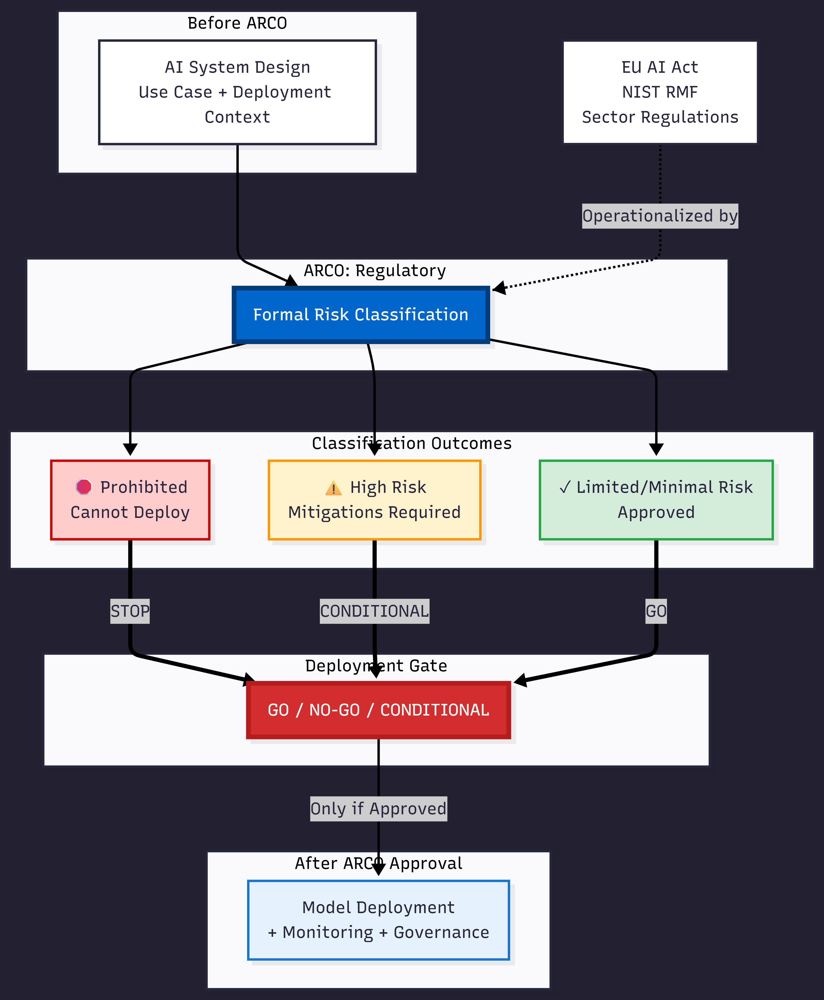

# ARCO
**Assurance & Regulatory Classification Ontology**

## Overview

ARCO is a framework for producing clear, defensible regulatory classifications for high-stakes AI systems.

Instead of generating scores, confidence levels, or probabilistic assessments, ARCO produces regulatory determinations that can be traced directly back to the structure and capabilities of the system being evaluated.

The goal is simple: **Replace probabilistic "confidence" with regulator-defensible logical determination.**

---

## 1. The Deployment Gate (How It Works)

ARCO operates upstream of model deployment. It functions as a formal regulatory decision point: **Is this system allowed to exist in this context?**



**Key Concept:** Monitoring, XAI, and governance platforms add value only once a system is allowed to exist. ARCO determines whether that investment should happen at all.

---

## 2. Where ARCO Fits in the Governance Ecosystem

Most AI governance today happens downstream.

Teams build systems, train models, wire pipelines, and only then ask whether what they've built is acceptable under regulation. At that point, governance becomes reactive. Risk is explained after the fact. Compliance is documented, not decided.

Regulatory frameworks like the EU AI Act, NIST RMF, and sector-specific rules assume a different order of operations. They are written around **prior determination**: before deployment, before exposure, before harm.

**This is the gap ARCO is designed to address.**

### From Interpretation to Determination

ARCO operates at the point where intent, use case, and deployment context first become concrete. Rather than analyzing model behavior or training data directly, ARCO evaluates the nature of the system: what it is intended to do, where it will be deployed, who it affects, and under what constraints.

This information is encoded in a formal, ontologically grounded structure and evaluated against regulatory criteria using deterministic logic. The result is not a probabilistic assessment or a policy checklist. It is a **formal risk classification** that can be treated as an authority signal: prohibited, high-risk with conditions, or approved within defined bounds.

### A Deployment Gate, Not a Reporting Layer

ARCO is not a monitoring tool, an explainability add-on, or a post-hoc audit artifact. Its output is designed to function as a **deployment gate**.

If a system is classified as prohibited or unmitigated high risk, that determination can halt deployment before downstream investments are made. If a system is conditionally approved, the required mitigations are explicit and traceable. If a system is approved, that approval becomes a stable reference point for subsequent governance, monitoring, and assurance work.

**This ordering matters.** Monitoring, XAI, and governance platforms add value only once a system is allowed to exist. ARCO determines whether that investment should happen at all.

### Deterministic Structure, Human Accountability

ARCO's core logic is deliberately deterministic. Probabilistic tools are useful for extraction and summarization, but regulatory decisions require stability. ARCO separates candidate generation from verification: probabilistic inputs may propose facts or classifications, but final determinations are produced through formal ontological encoding, structural validation, and rule-based reasoning.

This produces outputs that are legible to auditors, defensible to regulators, and usable by risk and compliance teams. It also preserves human accountability. Judgment does not disappear; it is constrained, documented, and made explicit rather than implicit.

### Position in the Ecosystem

ARCO does not replace existing AI infrastructure. It precedes it.

It sits upstream of model deployment, monitoring, and governance workflows, providing a clear answer to a foundational question: **Is this system allowed to exist in this context, under these rules?**

By answering that question early, ARCO reduces wasted effort, bounds regulatory risk, and gives organizations a stable anchor for everything that follows.

---

## 3. Core Documentation

This repository is structured to support both strategic review (leadership) and technical validation (engineering).

### 🏛️ Phase 1: Methodology (Strategic View)
*Recommended for Leadership, Product Owners, and Conceptual Alignment*

- **[The Logic-First Assurance Model](01_COMMERCIAL/ARCO_Assurance_Engine.pdf)**  
  Explains why probabilistic approaches break down in regulated domains and introduces the logic-first assurance model.

- **[Operational Command Center](01_COMMERCIAL/Command_Center.pdf)**  
  Provides the operational overview: scope, inputs, outputs, and how the assurance process is structured end-to-end.

### ⚙️ Phase 2: Execution (Operational View)
*Recommended for Technical Validation and Engagement Modeling*

- **[Sample Regulatory Certificate](01_COMMERCIAL/ARCO_Regulatory_Determination_Case.pdf)**  
  A concrete example of the final output: a traceable determination produced by the framework.

- **[Pilot Engagement Model](01_COMMERCIAL/ARCO_Pilot_Engagement_Scope.pdf)**  
  Defines how the framework would be deployed in a client setting, including the Statement of Work structure and engagement boundaries.

- **[Reference Implementation](03_TECHNICAL_CORE/scripts/run_pipeline.py)**  
  The executable pipeline demonstrating ontology ingestion, deterministic reasoning, and SHACL validation.

---

## Why ARCO Exists

Most AI compliance tools try to answer questions like:

- "How risky does this system appear?"
- "How confident are we that it complies?"
- "What score does the model produce?"

Those questions break down in regulated environments.

**Regulators, auditors, and courts do not evaluate probability. They evaluate justification.**

ARCO exists to answer a different question:

> **Given what this system is capable of doing, does it meet the legal criteria for a specific regulatory classification, yes or no?**

And to make that answer:

✓ **Deterministic**  
✓ **Explainable**  
✓ **Auditable**  
✓ **Reproducible**

---

## What ARCO Does

At a high level, the framework executes a five-step process:

1. **Start from system documentation**  
   Hardware, software components, deployment context, and intended use are treated as evidence, not narrative.

2. **Represent system capabilities explicitly**  
   Capabilities are encoded formally, including latent or conditional capabilities that may exist even if they are not currently active.

3. **Enforce structural completeness**  
   SHACL rules ensure required information is present and nothing material is assumed or inferred informally.

4. **Apply regulatory logic deterministically**  
   SPARQL queries test whether the encoded system satisfies the relevant legal criteria.

5. **Produce a traceable determination**  
   Every conclusion can be followed back to explicit facts and rules.

**The output is not advice or opinion. It is a conclusion that follows logically from the system's structure.**

---

## Getting Started (Run the Reference Pipeline)

This repository includes a reference implementation that demonstrates the full ARCO assurance pipeline in execution.

### Requirements
- Python 3.10 or newer

### Install dependencies
```bash
pip install rdflib pyshacl
```

### Run the pipeline
```bash
python 03_TECHNICAL_CORE/scripts/run_pipeline.py
```

### What you should see

- **Loaded triples:** Confirms the ontology and instance graphs loaded correctly
- **SPARQL ASK result:** `True` / `False` (Confirms the regulatory logic query executed successfully)
- **SHACL conforms:** `True` / `False` (Indicates whether the provided instance data satisfies the required documentation constraints)

**Note:** A `False` result does not indicate a system error. It means the SHACL validator identified missing or inconsistent required information, which is the intended behavior of the assurance process. The printed validation report shows exactly what is missing or invalid.

---

## What ARCO Is Not

ARCO is **not**:

- ❌ A probabilistic risk scoring tool
- ❌ A checklist generator
- ❌ A substitute for legal counsel
- ❌ A plug-and-play compliance dashboard

ARCO is best understood as a **formal assurance instrument**, similar in spirit to safety cases used in aerospace or medical systems, applied to AI regulatory classification.

---

## Status

ARCO is presented here as a reference-grade methodology and capability demonstration.

The technical foundation is intentionally explicit and auditable.

Future work focuses on validation, deployment, and refinement through real-world use.
