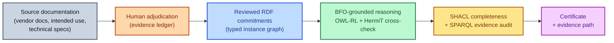

# ARCO

**Assurance & Regulatory Classification Ontology**

You're building an AI system. Somewhere down the line someone official asks you the question you can't wave off: now that the EU regulates this, is what we're building high-risk?

You want to know that immediately, not a year in, after the time's already sunk and you've built around the wrong answer.

And you can't put it all on the lawyers. Not because they're wrong, but because they're expensive, you can't get one on every design decision, and even a good one doesn't know your system the way you do, so what comes back is slow and hedged. What you need first is a way to walk your boss, or the regulator, down the line: here is why this lands where it lands, and here is the reason behind every step. Something you can point at and defend. Bring counsel in after that and you're handing them a clean starting point instead of paying them to take your system apart from scratch.

ARCO is a working proof that a tool like this can be built and trusted. You give it a structured description of a system: what the hardware can really do, what it's meant to be used for, who its decisions land on. It works out whether that meets the conditions for a high-risk category, and it shows the whole chain of reasoning that got there, so anyone who doubts the answer can walk back through it and point at the exact step they'd argue with. Same description in, same answer out, every time, and because it runs on fixed logic instead of a model's guess, anyone can re-run it and get the same result. The part that would turn it into a tool a compliance team could pick up, taking a plain vendor document and producing that structured description without an expert in the loop, is the next piece of work and is not done yet.

Underneath, ARCO runs on a formal foundation called BFO. It's an international standard (ISO/IEC 21838-2), and it's the shared base under hundreds of other projects, from biology to defense. What that buys you in plain terms: the words mean one fixed thing every time, so the answer tracks what your system actually is, not how the paperwork happens to be worded.

And it reaches past this one law. What ARCO checks is always the same three things: what a system can do, what it's for, and who it affects. That's what rules tend to reach for wherever someone gets held responsible, so the same machine re-aims at other categories and other rulebooks. I've built it out for two of the EU's high-risk categories so far.

The straight version: this is a solo open-source project. Two of the eight high-risk categories so far, no lawyer has signed off on the legal reading, and it's a working proof of the idea, not something to drop into a compliance team tomorrow. Everything it can't do is written down plainly in [LIMITATIONS.md](LIMITATIONS.md), on purpose.

[](https://github.com/Amosk21/ARCO/actions/workflows/arco-demo.yml) [](https://github.com/Amosk21/ARCO/actions/workflows/robot-validate.yml)

---

## The chain you can audit


```mermaid
flowchart LR
    SRC["Source documentation<br/>(vendor docs, intended use,<br/>technical specs)"]
    ADJ["Human adjudication<br/>(evidence ledger)"]
    COMMIT["Reviewed RDF commitments<br/>(typed instance graph)"]
    REASON["BFO-grounded reasoning<br/>OWL-RL + HermiT cross-check"]
    AUDIT["SHACL completeness<br/>+ SPARQL evidence audit"]
    CERT["Certificate<br/>+ evidence path"]

    SRC --> ADJ
    ADJ --> COMMIT
    COMMIT --> REASON
    REASON --> AUDIT
    AUDIT --> CERT

    style SRC fill:#cbd5e1,stroke:#475569,color:#0f172a,stroke-width:2px
    style ADJ fill:#fed7aa,stroke:#c2410c,color:#7c2d12,stroke-width:2px
    style COMMIT fill:#bfdbfe,stroke:#1d4ed8,color:#1e3a8a,stroke-width:2px
    style REASON fill:#bbf7d0,stroke:#15803d,color:#14532d,stroke-width:2px
    style AUDIT fill:#fde68a,stroke:#b45309,color:#78350f,stroke-width:2px
    style CERT fill:#f5d0fe,stroke:#a21caf,color:#581c87,stroke-width:2px
```

Every arrow is something a reviewer can inspect. Source documents license RDF commitments through human review and adjudication, not automated extraction (the kiosk demo walks one fixture through this end-to-end with an evidence ledger; the source packet there is hypothetical, and substituting a real vendor document is the next concrete step). Reviewed commitments enter a BFO-grounded graph. The OWL reasoner derives the classification by entailment over the public axioms. A second reasoner (HermiT, full OWL 2 DL profile) independently agrees on every push. SHACL validates that the supporting documentary record is structurally complete. SPARQL queries inspect the reasoned graph for the specific evidence each classification rests on. The certificate writes the classification, the evidence path, and the supporting structure in one place.

When a classification looks wrong, the chain locates the cause: a specific axiom, a specific input fact, a specific reasoning step.

---

## How to use it

```bash
git clone https://github.com/Amosk21/ARCO.git
cd ARCO
python -m venv .venv
source .venv/bin/activate  # Windows PowerShell: .venv\Scripts\Activate.ps1
python -m pip install -r requirements.txt
python 03_TECHNICAL_CORE/scripts/run_pipeline.py
```

Requirements: Python 3.10 or newer. Outputs land at `runs/demo/`: the certificate, a JSON summary, evidence bindings, the SHACL report. The same pipeline runs in CI on every push and pull request and uploads `runs/demo/` as a downloadable artifact. Every merge to `main` also redeploys the latest output to GitHub Pages, so the current certificate is one click away without cloning.

---

## What's modeled

ARCO encodes two Annex III categories as one architectural pattern instantiated twice. A system is applicable to a category only when all three conditions hold simultaneously:

| Annex III category | Capability *(reality)* | Intended use *(representation)* | Affected role *(representation)* |
|---|---|---|---|
| 1(a) Remote biometric identification | biometric identification | remote biometric identification | natural-person role |
| 5(b) Creditworthiness evaluation | creditworthiness evaluation | creditworthiness evaluation | natural-person role |

The three conditions together are a single OWL `equivalentClass` axiom, not a procedural check sequenced in code. The same pattern instantiates per category by referencing different capability and process classes. Cross-category isolation falls out of this structure: a biometric-only system cannot fire the creditworthiness axiom because its capability and intended-use are wrong for that axiom, no separate enforcement rule needed.

A separate flag (`HighRiskSystem`) fires from the capability gate alone. That flag is useful for surfacing latent risk where a system has the structural prerequisite without (yet) the documented intent, but it is not the legal high-risk classification.

---

## It's a pattern, not just this one demo

ARCO does two EU categories right now, but the part doing the real work isn't tied to the EU at all. Every answer comes down to three things: what the system can do, what it's meant to be used for, and who's on the receiving end. That's the same three things rules reach for over and over, because it's how responsibility tends to work: who can do the thing, what they meant to do with it, and who it lands on.

Once those three are written down as something a reasoner can work over, you can point it somewhere else. The same setup that checks a credit model has the shape to check a hiring tool, or a system that decides who gets seen first in an emergency room. Different details, same skeleton. So adding a category is mostly filling in the specifics, not rebuilding the machine.

One thing I want to be straight about, because it's the flip side of the same coin. Something flexible enough to re-aim across all those areas is flexible enough to be aimed at things I wouldn't sign off on, like profiling people at scale. There's no mechanism in the code that can stop that. Keeping ARCO pointed where it's pointed is a line I hold, not a lock I built, and I'd rather say that out loud than pretend the flexibility only cuts one way. The full disclosure is in [LIMITATIONS.md](LIMITATIONS.md) §12.

---

## What ARCO describes

> *Items marked with (\*) are work-in-progress: a modeling discipline articulated in the technical core but not yet exercised in fixtures, or a pending modeling decision with a clear path forward. Tracked in ARCO's internal working register.*

A system is a real physical thing. Its hardware components bear capabilities, which are actual physical properties of the hardware. A face-recognition module bears the capability to do biometric identification because of its hardware. The capability exists because of the hardware's physical structure. It is there whether the system is running or sitting idle.

Software running on the hardware is treated as information content (a Generically Dependent Continuant per BFO 2020, `bfo:0000031`). The software generically depends on the hardware that runs it (`bfo:0000084 g-depends`); the hardware concretizes the software via an inscription quality (`bfo:0000058 is_concretized_by`); and the hardware is what bears the capability disposition. (\*) The software-hardware concretization layer is articulated as discipline in `ARCO_core.ttl:181-185` but is not yet exercised in any fixture; the hardware-software amalgam is disclosed as a deliberate simplification at `LIMITATIONS.md §3.5`.

Separately, there are documents about the system. The vendor writes an Intended Use Specification saying what the system is for. The vendor writes a Use Scenario Specification saying which role categories the system operates on. These are claims the provider makes about the system; they are typed as Information Content Entities (`iao:0000030`). They describe the system; they are not the system.

ARCO's encoding concludes a system is Annex III applicable when three commitments come together:

1. The system's hardware bears a regulated capability. (\*) This first gate is ARCO's design-time evidential addition: the Act's own Annex III trigger is the documented intended purpose carried by gates 2 and 3, so a description with documented regulated intent but no reviewed capability commitment is not entailed — a deliberate strictness in the under-classification direction, disclosed in LIMITATIONS.
2. The vendor's intended use specification commits the system to a regulated process via the IUS subkind defined-class (`cco:prescribes someValuesFrom :Process`).
3. The use scenario specification designates the affected role category. For Annex III 1(a), this is natural persons. (\*) The relationship between this designated role and the system's process is pending tightening; the current axiom does not pin down whether natural persons are subjects of identification, operators of the system, or another role-in-context.

When all three appear in a reviewed graph, the reasoner concludes "Annex III applicable." Two reasoners (OWL-RL rule-based, HermiT tableau-based / OWL 2 DL) cross-check the conclusion. A regulator can take the axioms and the input facts and re-derive the classification with any OWL reasoner. No Python line decides the entailment; the pipeline's output composition is Python, and it is audited separately. (\*) The full entailment chain (around 20,000 entailed triples per run) is not yet exported in the published artifacts; surfacing the reasoned graph and HermiT classification output alongside the certificate is active work.

Some pieces of the picture are kept partial on purpose:

- ARCO does not mint specific natural-person particulars; no source warrant for them at design time.
- It does not model when or where the system runs (deliberate scope cut for a design-time classifier).
- It surfaces Article 6(3) derogation claims for human legal review without evaluating their validity.
- It surfaces Annex III 5(b) fraud-detection exclusion claims the same way: as audit-layer flags, not classification gates.

Some pieces are still being worked out (\*):

- Capability + Interest framing. The canonical capability framing is "a disposition whose realization is associated with the interest of an organism or group." ARCO currently models the disposition side; the interest hookup for capability accountability is pending decision.
- Regulatory text aboutness. How to express what the Annex III text is about beyond the universal class (canonical options surfaced; decision pending).
- Vocabulary cleanup. The compositional class name `:CapabilityDisposition` is pending rename to `:Capability` per Smith-Against-Idiosyncrasy Principle 8.

The architectural detail (BFO 2020 grounding, the seven modeling buckets, how the reasoner does its work) is in the section below.

---

## Why the architecture matters

Two choices make a classification something you can prove, not just produce.

First, it is reached by formal logic. The regulation's high-risk condition is written down as a definition, and a reasoner works out whether a system meets it. No line of code makes the call, so anyone with a standard reasoner can re-derive the result from the public definitions; the authority is the logic, not the pipeline.

Second, the definitions are grounded in BFO 2020 (ISO/IEC 21838-2:2021) and the Common Core Ontologies, which commit to what things actually are rather than convenient labels. A capability is a real property of the hardware, present whether the system runs or not, so the classification follows what a system is rather than how it happens to be described, and the terms mean the same thing across organizations because they share a foundation. That grounding is what the seven-bucket BFO modeling discipline operationalizes: material entities, qualities, realizable entities, processes, immaterial entities, temporal regions, and information artifacts are the seven categories every model has to populate or honestly disclose a scope cut on, and bucket assignment for each modeled entity is canonical, not improvised. The BFO 2020 axioms live at `imports/bfo-2020.owl`; the seven-bucket discipline is laid out in the diagrams at `docs/modeling_decisions/`.

**Reality and representation are kept separate.** Capabilities are physical: a hardware component bears them as BFO dispositions (`ARCO_core.ttl:114-127`). Intended uses, use scenarios, and compliance determinations are documentary: IAO information content entities about the system. The reasoner enforces the separation through BFO 2020 standard disjointness between Independent Continuant and Generically Dependent Continuant; the binding mechanism that catches category errors at materialization time is verified by `03_TECHNICAL_CORE/scripts/probe_disjointness_and_binding.py`.

**Source documentation reaches the graph through human adjudication, not automated extraction.** Vendor documentation, intended-use specs, and technical evidence pass through a reviewed evidence ledger before becoming RDF commitments. Source documents generate descriptive ICE claims; promotion of a claim to a reality-side commitment is rare, conditional, and human-adjudicated. No automated extraction writes to instance TTL. The kiosk demo v1 (`docs/kiosk_demo_v1/`) is the first structural sketch of the evidence-ledger step; substituting a real vendor document for the current hypothetical packet and wiring the source-to-commitment chain programmatically is `OPEN_PROBLEMS.md L1.1` (no evidence ledger is yet programmatically backed for any fixture).

**Dispositions exist as particulars, not just class declarations.** Every fixture instantiates its capability disposition and asserts the bearer relation via `ro:0000091 has_disposition`. Sentinel additionally asserts the realization chain via `bfo:0000055 realizes` (`ARCO_instances_sentinel.ttl:37, 86`). Other fixtures leave realization unmodeled at design time, disclosed at `LIMITATIONS.md §3.7.a`. The graph carries actual disposition instances, not just class hierarchies.

**Classification is entailment, not procedure.** The Annex III applicability classes are defined by their conditions (three-gate equivalentClass axioms at `ARCO_governance_extension.ttl`). When a system satisfies them, the reasoner adds the membership triple. No Python decides the classification; the axioms do, mechanically. Exposing the full entailment chain in published artifacts is active surfacing work (`OPEN_PROBLEMS.md L4.8`); the classification is already re-derivable from the public axioms by anyone with an OWL reasoner.

**Two reasoners cross-check every classification.** OWL-RL (rule-based, materializes ~20,000 entailed triples per run) and HermiT (tableau-based, full OWL 2 DL profile) agree on every classification across the certificate-grade fixtures. Two reasoners using different algorithms reaching the same answer is a stronger signal than either alone. The CI workflow at `.github/workflows/robot-validate.yml` runs the cross-check on every PR.

**The three layers do different jobs and are not interchangeable.** OWL-RL classifies (entails membership in the Annex III applicability classes). SHACL validates that the documentary record supporting a determination is structurally complete. SPARQL audits the post-reasoning graph and surfaces conditions for human review. A SHACL pass does not mean the system is high-risk. A SPARQL false does not overturn an OWL classification. The certificate's auditability turns on keeping the layers distinct.

**Actual OWL inference fires, not string matching.** Two adversarial fixtures, one per modeled Annex III category, type their capability dispositions only as a decoy class (`:WeirdScanner` for 1(a), `:WeirdCalculator` for 5(b)); the regulated class is not asserted as the disposition's type, and the connection runs through an `owl:equivalentClass` declaration in each. A third fixture's disposition has no IRI at all (anonymous blank node, `ARCO_instances_adversarial_blanknode.ttl:28`). All three classify correctly because the reasoner performs actual OWL inference: the decoys via `owl:equivalentClass` propagation, the blank-node fixture via `owl:someValuesFrom` satisfaction. An approach that did string matching on class names, or required named individuals at every position, would miss them.

**Layer separation is verified by fixtures.** Two flag-test fixtures present cases where all three Annex III gates are satisfied AND an audit-layer flag (a provider-asserted `:DerogationClaim`, or a `:FraudDetectionProcess` token) is also present. The OWL classification fires regardless of the audit flag; the flag fires alongside the classification. Classification and audit do not bleed into each other.

**Gate independence is empirically verified.** A regression test removes the supporting triples for each Annex III 1(a) and 5(b) gate in turn and confirms the classification fails. Each gate is independently necessary in both categories; removing any one breaks the entailment. Content-mutation variants (wrong process type, wrong designation target) verify that the gates check content, not just existence.

**The certificate's classification binds to graph queries.** Classification field and evidence path are bound to SPARQL queries against the reasoned graph; the contract lives in `03_TECHNICAL_CORE/scripts/output_manifest_v2.yaml`, enforced by `test_output_provenance.py`. The former Article 6(3) mixed-provenance failure is closed; broader provenance-label and schema hardening remains active work ([`OPEN_PROBLEMS.md L4.4-L4.6`](OPEN_PROBLEMS.md), [`LIMITATIONS.md §7.5`](LIMITATIONS.md)).

**The graph stays honest about what it doesn't know.** ARCO does not mint participant facts, temporal regions, role-bearer particulars, or other instance-level content that source evidence does not warrant. Under the Open World Assumption, absent triples mean "not asserted by the reviewed commitments," not "denied." Keeping the graph sparse where evidence is sparse is a project discipline, enforced in code review.

---

## What we're working on

The three-gate pattern (capability + intended use + affected role) generalizes beyond the EU AI Act to regulatory regimes where obligations attach to those three things; adding categories follows the existing pattern as content work, not architecture work. The table below tracks load-bearing modeling decisions and scoped active work.

| What | Stage |
|---|---|
| Renaming the main capability class from `:CapabilityDisposition` to `:Capability` so the name represents one concept rather than two glued together | Ready to land |
| Moving the Gate 3 design rationale out of inline code comments into proper modeling docs so a reviewer can find the reasoning without reading the TTL | Ready to land |
| Adding the "who has an interest in this capability" relationship to the capability model. Right now ARCO captures what a capability can do but not who its outcomes serve; three approaches being weighed | Decision pending |
| Specifying what each Annex III rule actually points at inside ARCO. Currently it points at a class; tightening to point at specific systems or sets of things together is under consideration | Decision pending |
| Tightening Gate 3 to specify HOW the system relates to the natural persons it affects. Today it just says natural persons are involved; it doesn't distinguish between persons being identified by the system, persons operating it, or persons simply nearby | Decision pending |
| Tightening Gate 2's match to the regulation's actual wording. Today Gate 2 checks that the system is documented to perform a specific process kind; the regulation actually keys on the intended purpose, which is a slightly looser match | Decision pending |
| Replacing the kiosk demo's hypothetical vendor packet with a real vendor document, so the demo runs on actual source evidence rather than hypothetical content | Active work |
| Publishing the full reasoning output (around 20,000 derived facts per run) plus the second reasoner's separate result per fixture, so anyone can independently check both the conclusions and that two different reasoners agree | Active work |
| Labeling every certificate field with where its value came from (a graph query result, the run's metadata, or a scope-disclosure note) and adding a CI check that verifies every field traces back to its declared source | Active work |
| Extending the test that confirms each Gate is necessary from Annex III 1(a) to also cover 5(b), so both classifications have the same proof that none of the three gates is decorative | Landed 2026-05-14 |

Day-to-day rows live in `OPEN_PROBLEMS.md` (internal); the public roadmap with verified core, resolved modeling decisions, and execution sequence is at [`docs/MODELING_ROADMAP.md`](docs/MODELING_ROADMAP.md).

---

## What it doesn't do

- No citation chain from intended use to specific clauses in vendor documents (Article 3(12)). Queued.
- No Article 6(3) derogation evaluation. The claim is surfaced for human legal review, not judged.
- No Article 5 prohibition routing. The 5(1)(h) real-time-in-publicly-accessible-spaces subset is not split out from the parent 1(a) class.
- No automatic obligation chain. Article 16 (provider) and 26 (deployer) duties are not entailed from positive classification.
- Only 2 of 8 Annex III categories modeled.
- No raw document ingestion. ARCO consumes structured RDF; turning vendor PDFs into structured RDF is a separate upstream problem.

For the complete disclosure surface, see [`LIMITATIONS.md`](LIMITATIONS.md).

---

## Foundational ontology versions

| Ontology | Version | Loaded as |
|---|---|---|
| **BFO** | BFO 2020 (ISO/IEC 21838-2:2021) | Full ontology, `imports/bfo-2020.owl` |
| **RO** | OBO Relations Ontology release `2025-12-17` | ROBOT BOT slim module |
| **IAO** | Information Artifact Ontology release `2026-03-30` | ROBOT BOT slim module |
| **CCO** | Common Core Ontologies v1.7 (pinned semantic-IRI release) | ROBOT BOT slim module + local bridge declarations |

The BOT-extracted slim modules carry a formal entailment-preservation guarantee (syntactic locality module extraction, Cuenca Grau et al. 2007/2008): for any axiom whose signature is contained in the seed signature, the slim module entails the axiom if and only if the full upstream ontology does. The slim modules are not lossy abbreviations; they are logically equivalent to the full upstreams for the seed signature ARCO uses, with substantially faster reasoning. The seed term lists are version-controlled at `03_TECHNICAL_CORE/ontology/imports/seeds/` and the slim modules can be regenerated reproducibly from the pinned upstream releases.

---

## More

- [`LIMITATIONS.md`](LIMITATIONS.md). Scope cuts, disclosed non-claims, and dual-use disclosure.
- [`docs/modeling_decisions/`](docs/modeling_decisions/). Canonical diagrams and decisions justification map; every load-bearing modeling decision anchored to a specific TTL file or canon citation.
- [`docs/kiosk_demo_v1/`](docs/kiosk_demo_v1/). Narrative walkthrough of one fixture from source documentation to certificate. Programmatic wiring to the TTL fixture is pending (`OPEN_PROBLEMS.md L1.1`); source packet is hypothetical.
