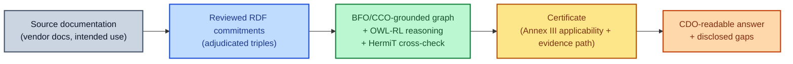

# ARCO

**Assurance & Regulatory Classification Ontology**

ARCO classifies AI systems against EU AI Act Annex III at design time, before deployment. Given a structured RDF description of a system (components, dispositions, intended use, use scenario), the pipeline tells you whether the system satisfies ARCO's formal encoding of Annex III conditions, and exactly why. Same input, same answer, every run. The output is a deterministic OWL entailment over hand-reviewed commitments, not a confidence score and not a legal opinion.

ARCO is an open-source solo learning and research project. It is a research-grade applied ontology and reference pipeline, not a deployable compliance product. Current scope is bounded to EU Regulation 2024/1689 Annex III categories 1(a) (remote biometric identification) and 5(b) (creditworthiness evaluation). The encoded interpretation has not been externally reviewed by qualified counsel or by the EU AI Office. Issues, corrections, and modeling critiques are welcome.

[](https://github.com/Amosk21/ARCO/actions/workflows/arco-demo.yml) [](https://github.com/Amosk21/ARCO/actions/workflows/robot-validate.yml)

---

## TL;DR

- **What.** ARCO tells you whether a structured description of your AI system satisfies ARCO's formal encoding of EU AI Act Annex III conditions, and exactly why, with the entailment chain re-derivable from public axioms.
- **How.** OWL-RL classification over a BFO 2020-grounded ontology (RO, IAO, CCO loaded as ROBOT BOT slim modules), SHACL for documentary completeness, SPARQL ASK on the reasoned graph for audit. HermiT OWL 2 DL cross-check in CI on every push to `main` and every pull request.
- **Run it.** `python 03_TECHNICAL_CORE/scripts/run_pipeline.py` from a fresh clone produces a condition-assessment certificate at `runs/demo/certificate.txt`.

---

## What's modeled

ARCO formally encodes two Annex III categories. A system is classified into a category only when **all three** of these conditions hold for that row:

| Annex III category | The system has a component capable of... | ...and is documented as intended to... | ...affecting... |
|---|---|---|---|
| 1(a) Remote biometric identification | biometric identification | perform remote biometric identification | natural persons |
| 5(b) Creditworthiness evaluation | creditworthiness evaluation | evaluate creditworthiness or assign credit scores | natural persons |

The three conditions are checked formally against the system's RDF description by OWL reasoning. Cross-category isolation (a biometric-only system cannot be classified as creditworthiness, and vice versa) is enforced by the ontology itself, not by hand. A separate precondition flag (`HighRiskSystem`) fires when just the capability is present (column 1 only); that flag is not the full applicability category — the full category needs all three.

---

## How it works (the chain)


```mermaid
flowchart LR
    SRC["Source documentation<br/>(vendor docs, intended use)"]
    --> COMMIT["Reviewed RDF commitments<br/>(adjudicated triples)"]
    --> REASON["BFO/CCO-grounded graph<br/>+ OWL-RL reasoning<br/>+ HermiT cross-check"]
    --> ANSWER["Certificate<br/>(Annex III applicability + evidence path)"]
    --> CDO["CDO-readable answer<br/>+ disclosed gaps"]

    style SRC fill:#cbd5e1,stroke:#475569,color:#0f172a,stroke-width:2px
    style COMMIT fill:#bfdbfe,stroke:#1d4ed8,color:#1e3a8a,stroke-width:2px
    style REASON fill:#bbf7d0,stroke:#15803d,color:#14532d,stroke-width:2px
    style ANSWER fill:#fde68a,stroke:#b45309,color:#78350f,stroke-width:2px
    style CDO fill:#fed7aa,stroke:#c2410c,color:#7c2d12,stroke-width:2px
```

Each arrow is auditable. Source documentation licenses reviewed RDF commitments via a documented evidence-to-commitment pattern; the kiosk demo ([`docs/kiosk_demo_v1/`](docs/kiosk_demo_v1/)) walks one fixture through it end-to-end against a hypothetical source packet (substituting a real vendor document is the next concrete step). The reasoned graph is verified by `test_gate_removal.py` (Sentinel 1(a); 5(b) coverage queued) and by HermiT cross-check on certificate-grade fixtures. The certificate's classification line and evidence path are graph-derived; the surrounding pass/fail summary fields are currently Python-composed and are being moved to a graph-bound emitter (see [`LIMITATIONS.md §7.5`](LIMITATIONS.md)).

For the canonical diagrams (value chain, seven buckets, three-gate axiom, decisions justification map), see [`docs/modeling_decisions/`](docs/modeling_decisions/).

---

## Sample certificate output

```text
========================================================================
ARCO CONDITION ASSESSMENT CERTIFICATE
========================================================================
  SYSTEM:                  Sentinel_ID_System
  REGIME:                  ARCO ontology encoding of EU AI Act (Article 6 / Annex III)
  PRIMARY ARCO CLASSIFICATION:  AnnexIII1aApplicableSystem (ENTAILED, all three ARCO gates)
  LATENT-RISK FLAG:             HighRiskSystem (Annex III Capability-Precondition Flag;
                                INFERRED via Gate 1 only;
                                not the EU AI Act legal high-risk classification)
  TRIGGERING CAPABILITY:   Sentinel_FaceID_Disposition
  EVIDENCE PATH:
  Sentinel_ID_System -> Sentinel_FaceID_Module -> Sentinel_FaceID_Disposition
  SHACL:                   PASS
  ANNEX III 1(a):          VERIFIED (ENTAILED, Article 6(3) derogation not evaluated)
  ANNEX III 5(b):          NOT APPLICABLE
  ENTAILED TRIPLES ADDED:  +20160

  [exception flags - provider-submitted claims, human review required]
  ART. 6(3) DEROGATION:    NOT FLAGGED
  5(b) FRAUD EXCLUSION:    NOT FLAGGED

  SCOPE: ARCO assesses structured RDF instance data supplied to the pipeline.
         It does not verify raw vendor documentation, the physical deployed
         system, or legal sufficiency. ARCO currently models Annex III 1(a)
         (biometric identification) and 5(b) (creditworthiness) only.
========================================================================
```

The classification result is **derived**, not asserted: removing any gate triple causes the entailment to fail (verified by `test_gate_removal.py` on Sentinel 1(a); 5(b) coverage queued). The reference pipeline writes the certificate, JSON summary, evidence bindings, and SHACL report to `runs/demo/`.

**Output-layer caveat.** The classification line and the evidence path are computed directly from the reasoned graph. Some of the surrounding pass/fail fields are still composed by Python rather than queried from the graph; that is a known bug being worked on. Disclosed in [`LIMITATIONS.md §7.5`](LIMITATIONS.md).

---

## What works today

**Seven systems across six fixtures.** Two positive (Sentinel 1(a), CreditScorer 5(b)), one negative (Verification Kiosk — 1:1 verification is not in the triggering capability union), two adversarial, two flag-test.

**The adversarial fixtures verify the reasoner does real DL work, not IRI pattern-matching.** The decoy fixture types its disposition only as `:WeirdScanner`, declared `owl:equivalentClass :BiometricIdentificationCapability`; classification fires through equivalence propagation. The blank-node fixture's disposition has no IRI at all (anonymous individual typed as `:BiometricIdentificationCapability`); `owl:someValuesFrom` is satisfied by existential entailment. A Python script doing `rdf:type` lookup on either disposition returns false for the regulated class; OWL-RL returns true.

**The flag-test fixtures verify layer separation.** All three gates satisfied AND a `:DerogationClaim` or `:FraudDetectionProcess` present; the OWL classification fires regardless of the audit flag. Classification and audit do not bleed.

**Gate-removal regression** (`test_gate_removal.py`) proves each Annex III 1(a) gate is independently necessary by removing supporting triples in turn and verifying the entailment fails (5(b) symmetric coverage queued, `OPEN_PROBLEMS` L3.5).

**HermiT OWL 2 DL cross-check** runs in CI against all six certificate-grade fixtures with one documented reasoner-profile divergence on the blank-node audit-side latent-risk traversal (see [`LIMITATIONS.md §7.4`](LIMITATIONS.md)).

**Kiosk demo (PR #38)** walks one fixture end-to-end source packet → evidence ledger → reviewed RDF → reasoner non-entailment → certificate, with each commitment adjudicated per the documented evidence-to-commitment policy. Source packet is hypothetical.

---

## What ARCO does NOT do

- **No paper trail to source documents.** The Article 3(12) citation chain from intended use to specific clauses in vendor materials (instructions for use, technical documentation, promotional copy) is queued.
- **No Article 6(3) derogation evaluation.** ARCO surfaces the provider's claim for human legal review; it does not judge the claim.
- **No Article 5 prohibition routing.** The 5(1)(h) real-time-RBI-in-publicly-accessible-spaces subset is not split out from the parent 1(a) class.
- **No obligation chain.** Article 16 (provider) and Article 26 (deployer) duties are not entailed from positive classification.
- **Only 2 of 8 Annex III categories.** 1(a) and 5(b) are modeled. Others follow the same three-gate pattern; content work, not architecture work.
- **No raw document ingestion.** ARCO consumes hand-reviewed RDF, not vendor PDFs. LLM-assisted extraction may help upstream of the classification path; it never participates in classification.

See [`LIMITATIONS.md`](LIMITATIONS.md) for the full disclosure surface.

---

## Upcoming

**Active sequenced work.**
- Replace the kiosk demo's hypothetical source packet with real vendor documentation; closes the input-mile demonstration from structural to substantive
- Complete output-layer graph binding (schema v2, per-field source-query manifest, G/M/D provenance labels)
- Extend `test_gate_removal.py` to cover Annex III 5(b) CreditScorer symmetrically
- Auto-generated reasoning-chain artifact per fixture so the diagram tracks the code

**Stated goals.**
- The architecture generalizes. The three-gate pattern (capability + prescribed process + affected role) reuses for GDPR Article 22 (automated decision-making), NYC Local Law 144 (automated employment decision tools), HIPAA covered electronic transactions, and other regimes where obligations attach to capability, intended use, and affected subject.
- Additional Annex III categories follow the same pattern as content work, not architecture work.
- Demonstrate the chain on a real-world AI system with real provider documentation.

---

## Getting started

Requirements: Python 3.10 or newer.

```bash
git clone https://github.com/Amosk21/ARCO.git
cd ARCO
python -m venv .venv
source .venv/bin/activate  # Windows PowerShell: .venv\Scripts\Activate.ps1
python -m pip install -r requirements.txt
python 03_TECHNICAL_CORE/scripts/run_pipeline.py
```

The pipeline loads BFO + BOT-extracted RO/IAO/CCO + ARCO core/governance + Sentinel instance data; runs OWL-RL closure; validates SHACL; runs SPARQL ASK audit queries on the reasoned graph; and writes outputs to `runs/demo/`. The same pipeline runs in CI (Actions > ARCO Demo Run) and the workflow uploads `runs/demo/` as a downloadable artifact.

---

## Foundational ontology versions

| Ontology | Version | Loaded as |
|---|---|---|
| **BFO** | BFO 2020 (ISO/IEC 21838-2:2021) | Full ontology, `imports/bfo-2020.owl` |
| **RO** | OBO Relations Ontology release `2025-12-17` | ROBOT BOT slim module |
| **IAO** | Information Artifact Ontology release `2026-03-30` | ROBOT BOT slim module |
| **CCO** | Common Core Ontologies v1.7 (pinned semantic-IRI release) | ROBOT BOT slim module + local bridge declarations |

---

## More

- [`LIMITATIONS.md`](LIMITATIONS.md) — scope cuts, disclosed non-claims, and dual-use disclosure
- [`docs/modeling_decisions/`](docs/modeling_decisions/) — canonical diagrams and decisions justification map
- [`docs/kiosk_demo_v1/`](docs/kiosk_demo_v1/) — worked input-mile example (source packet, evidence ledger, decision packet; hypothetical source)
