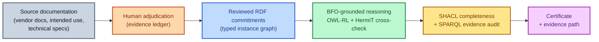

# ARCO

**Assurance & Regulatory Classification Ontology**

ARCO answers a specific question about an AI system: before you build or deploy it, does it satisfy the formal encoding of an EU AI Act Annex III high-risk condition? You hand the pipeline a structured description of the system (the hardware, what it's intended to be used for, who its decisions affect) and the OWL reasoner returns the answer with the reasoning chain attached. The same input always produces the same answer, and anyone with an OWL reasoner can re-derive the classification from the public axioms. ARCO's own pipeline is not part of the audit trail; the axioms and the input facts are.

The problem this solves: a compliance team, regulator, or buyer needs to know whether a specific AI system falls under Annex III before it ships. A probabilistic score isn't a defensible answer to that question. A checklist asking "does the document exist" misses what's in the document. A behavioral monitor only runs after deployment. ARCO produces a determination upstream of all of that, with the reasoning chain inspectable triple by triple.

Open-source solo research project. Current encoding covers Annex III 1(a) (remote biometric identification) and 5(b) (creditworthiness evaluation); the encoded interpretation has not been externally reviewed by counsel; not a deployable compliance product.

[](https://github.com/Amosk21/ARCO/actions/workflows/arco-demo.yml) [](https://github.com/Amosk21/ARCO/actions/workflows/robot-validate.yml)

---

## The chain you can audit


```mermaid
flowchart LR
    SRC["Source documentation<br/>(vendor docs, intended use,<br/>technical specs)"]
    --> ADJ["Human adjudication<br/>(evidence ledger)"]
    --> COMMIT["Reviewed RDF commitments<br/>(typed instance graph)"]
    --> REASON["BFO-grounded reasoning<br/>OWL-RL + HermiT cross-check"]
    --> AUDIT["SHACL completeness<br/>+ SPARQL evidence audit"]
    --> CERT["Certificate<br/>+ evidence path"]

    style SRC fill:#cbd5e1,stroke:#475569,color:#0f172a,stroke-width:2px
    style ADJ fill:#fed7aa,stroke:#c2410c,color:#7c2d12,stroke-width:2px
    style COMMIT fill:#bfdbfe,stroke:#1d4ed8,color:#1e3a8a,stroke-width:2px
    style REASON fill:#bbf7d0,stroke:#15803d,color:#14532d,stroke-width:2px
    style AUDIT fill:#fde68a,stroke:#b45309,color:#78350f,stroke-width:2px
    style CERT fill:#f5d0fe,stroke:#a21caf,color:#581c87,stroke-width:2px
```

Every arrow is something a reviewer can inspect. Source documents license RDF commitments through human review and adjudication, not automated extraction (the kiosk demo walks one fixture through this end-to-end with an evidence ledger; the source packet there is hypothetical, and substituting a real vendor document is the next concrete step). Reviewed commitments enter a BFO-grounded graph. The OWL reasoner derives the classification by entailment over the public axioms. A second reasoner (HermiT, full OWL 2 DL profile) independently agrees on every push. SHACL validates that the supporting documentary record is structurally complete. SPARQL queries inspect the reasoned graph for the specific evidence each classification rests on. The certificate writes the classification, the evidence path, and the supporting structure in one place.

When a classification looks wrong, the chain locates the cause: a specific axiom, a specific input fact, a specific reasoning step.

---

## How to use it

```bash
git clone https://github.com/Amosk21/ARCO.git
cd ARCO
python -m venv .venv
source .venv/bin/activate  # Windows PowerShell: .venv\Scripts\Activate.ps1
python -m pip install -r requirements.txt
python 03_TECHNICAL_CORE/scripts/run_pipeline.py
```

Requirements: Python 3.10 or newer. Outputs land at `runs/demo/`: the certificate, a JSON summary, evidence bindings, the SHACL report. The same pipeline runs in CI on every push and pull request and uploads `runs/demo/` as a downloadable artifact. Every merge to `main` also redeploys the latest output to GitHub Pages, so the current certificate is one click away without cloning.

---

## What's modeled

ARCO encodes two Annex III categories as one architectural pattern instantiated twice. A system is applicable to a category only when all three conditions hold simultaneously:

| Annex III category | Capability *(reality)* | Intended use *(representation)* | Affected role *(representation)* |
|---|---|---|---|
| 1(a) Remote biometric identification | biometric identification | remote biometric identification | natural-person role |
| 5(b) Creditworthiness evaluation | creditworthiness evaluation | creditworthiness evaluation | natural-person role |

The three conditions together are a single OWL `equivalentClass` axiom, not a procedural check sequenced in code. The same pattern instantiates per category by referencing different capability and process classes. Cross-category isolation falls out of this structure: a biometric-only system cannot fire the creditworthiness axiom because its capability and intended-use are wrong for that axiom, no separate enforcement rule needed.

A separate flag (`HighRiskSystem`) fires from the capability gate alone. That flag is useful for surfacing latent risk where a system has the structural prerequisite without (yet) the documented intent, but it is not the legal high-risk classification.

---

## Why the architecture matters

What follows is what the architecture buys you that a procedural script could not.

**Reality and representation are kept separate.** Capabilities are physical: a hardware component bears them as BFO dispositions. Intended uses, use scenarios, and compliance determinations are documentary: IAO information content entities about the system. A reviewer can ask what the system has the capacity to do and what the provider has committed to as two separate questions with separate answers. The ontology treats mixing them as a category error and the reasoner enforces that.

**Classification is entailment, not procedure.** The Annex III applicability classes are defined by their conditions. When a system satisfies them, the reasoner adds the membership triple. No piece of code decides the classification; the axioms do, mechanically. A regulator does not need to trust the pipeline's source code; the axioms and the input facts are the audit trail.

**The three layers do different jobs and are not interchangeable.** OWL-RL classifies (entails membership in the Annex III applicability classes). SHACL validates that the documentary record supporting a determination is structurally complete. SPARQL audits the post-reasoning graph and surfaces conditions for human review. A SHACL pass does not mean the system is high-risk. A SPARQL false does not overturn an OWL classification. Keeping the layers distinct is what makes the certificate auditable; conflating them is easy to do in prose and breaks the audit story.

**The reasoner does real OWL inference.** One adversarial fixture types its capability disposition only as `:WeirdScanner`. The regulated class IRI never appears in the input data; the connection runs through an `owl:equivalentClass` declaration. Another fixture's disposition has no IRI at all (it's a blank node). Both classify correctly because the reasoner performs actual OWL inference. An approach that did string matching on class names, or required named individuals at every position, would miss both.

**Two reasoners cross-check each other.** OWL-RL (rule-based) and HermiT (tableau-based, full OWL 2 DL profile) agree on every classification across the certificate-grade fixtures. Two reasoners using different algorithms reaching the same answer is a stronger signal than either one alone. Disagreements would surface consistency issues a single reasoner could miss.

**Layer separation is verified by fixtures.** Two flag-test fixtures present cases where all three Annex III gates are satisfied AND an audit-layer flag (a provider-asserted `:DerogationClaim`, or a `:FraudDetectionProcess` token) is also present. The OWL classification fires regardless of the audit flag; the flag fires alongside the classification. Classification and audit do not bleed into each other.

**Gate independence is empirically verified.** A regression test removes the supporting triples for each Annex III 1(a) gate in turn and confirms the classification fails. Each gate is independently necessary; removing any one breaks the entailment. (Symmetric coverage for 5(b) is queued.)

**Every output value has a declared source.** The output-provenance contract lives in `03_TECHNICAL_CORE/scripts/output_manifest_v2.yaml` (the declarations) and `test_output_provenance.py` (failing-by-design enforcement). The certificate's classification and evidence path are bound to SPARQL queries against the reasoned graph, not to Python literals. Tightening provenance labels across the remaining surrounding fields is active work, disclosed in [`LIMITATIONS.md §7.5`](LIMITATIONS.md).

**The graph stays honest about what it doesn't know.** ARCO does not mint participant facts, temporal regions, role-bearer particulars, or other instance-level content that source evidence does not warrant. Under the Open World Assumption, absent triples mean "not asserted by the reviewed commitments," not "denied." Keeping the graph sparse where evidence is sparse is a project discipline, not a hypothetical future task.

---

## What we're working on

The next concrete step is substituting the kiosk demo's hypothetical source packet for a real vendor document, which moves the input-mile chain from structural demonstration to substantive grounding. Completing output-layer graph binding, extending the gate-removal regression test to 5(b), and auto-generating the chain diagram from the codebase so it cannot drift from reality are also in the active queue. The three-gate pattern (capability + intended use + affected role) generalizes beyond the EU AI Act to regulatory regimes where obligations attach to those three things; adding categories follows the existing pattern as content work, not architecture work.

---

## What it doesn't do

- No citation chain from intended use to specific clauses in vendor documents (Article 3(12)). Queued.
- No Article 6(3) derogation evaluation. The claim is surfaced for human legal review, not judged.
- No Article 5 prohibition routing. The 5(1)(h) real-time-in-publicly-accessible-spaces subset is not split out from the parent 1(a) class.
- No automatic obligation chain. Article 16 (provider) and 26 (deployer) duties are not entailed from positive classification.
- Only 2 of 8 Annex III categories modeled.
- No raw document ingestion. ARCO consumes structured RDF; turning vendor PDFs into structured RDF is a separate upstream problem.

For the complete disclosure surface, see [`LIMITATIONS.md`](LIMITATIONS.md).

---

## Foundational ontology versions

| Ontology | Version | Loaded as |
|---|---|---|
| **BFO** | BFO 2020 (ISO/IEC 21838-2:2021) | Full ontology, `imports/bfo-2020.owl` |
| **RO** | OBO Relations Ontology release `2025-12-17` | ROBOT BOT slim module |
| **IAO** | Information Artifact Ontology release `2026-03-30` | ROBOT BOT slim module |
| **CCO** | Common Core Ontologies v1.7 (pinned semantic-IRI release) | ROBOT BOT slim module + local bridge declarations |

The BOT-extracted slim modules carry a formal entailment-preservation guarantee (syntactic locality module extraction, Cuenca Grau et al. 2007/2008): for any axiom whose signature is contained in the seed signature, the slim module entails the axiom if and only if the full upstream ontology does. The slim modules are not lossy abbreviations; they are logically equivalent to the full upstreams for the seed signature ARCO uses, with substantially faster reasoning. The seed term lists are version-controlled at `03_TECHNICAL_CORE/ontology/imports/seeds/` and the slim modules can be regenerated reproducibly from the pinned upstream releases.

---

## More

- [`LIMITATIONS.md`](LIMITATIONS.md). Scope cuts, disclosed non-claims, and dual-use disclosure.
- [`docs/modeling_decisions/`](docs/modeling_decisions/). Canonical diagrams and decisions justification map; every load-bearing modeling decision anchored to a specific TTL file or canon citation.
- [`docs/kiosk_demo_v1/`](docs/kiosk_demo_v1/). Worked input-mile example: source packet, evidence ledger, decision packet (source packet is hypothetical).
