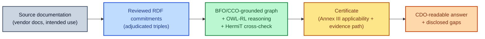

# ARCO

**Assurance & Regulatory Classification Ontology**

ARCO classifies AI systems against EU AI Act Annex III at design time, before deployment. Given a structured RDF description of a system (components, dispositions, intended use, use scenario), the pipeline tells you whether the system satisfies ARCO's formal encoding of Annex III conditions, and exactly why. Same input, same answer, every run. The output is a deterministic OWL entailment over hand-reviewed commitments, not a confidence score and not a legal opinion.

ARCO is an open-source solo learning and research project. It is a research-grade applied ontology and reference pipeline, not a deployable compliance product. Current scope is bounded to EU Regulation 2024/1689 Annex III categories 1(a) (remote biometric identification) and 5(b) (creditworthiness evaluation). The encoded interpretation has not been externally reviewed by qualified counsel or by the EU AI Office. Issues, corrections, and modeling critiques are welcome.

[](https://github.com/Amosk21/ARCO/actions/workflows/arco-demo.yml) [](https://github.com/Amosk21/ARCO/actions/workflows/robot-validate.yml)

---

## TL;DR

- **What.** ARCO tells you whether a structured description of your AI system satisfies ARCO's formal encoding of EU AI Act Annex III conditions, and exactly why, with the entailment chain re-derivable from public axioms.
- **How.** OWL-RL classification over a BFO 2020-grounded ontology (RO, IAO, CCO loaded as ROBOT BOT slim modules), SHACL for documentary completeness, SPARQL ASK on the reasoned graph for audit. HermiT OWL 2 DL cross-check in CI on every push to `main` and every pull request.
- **Run it.** `python 03_TECHNICAL_CORE/scripts/run_pipeline.py` from a fresh clone produces a condition-assessment certificate at `runs/demo/certificate.txt`.

---

## What's modeled

| Annex III category | Capability (Gate 1) | Prescribed process (Gate 2) | Affected role (Gate 3) |
|---|---|---|---|
| 1(a) Remote biometric identification | `BiometricIdentificationCapability` | `RemoteBiometricIdentificationProcess` | `NaturalPersonRole` |
| 5(b) Creditworthiness evaluation | `CreditworthinessEvaluationCapability` | `CreditworthinessEvaluationProcess` | `NaturalPersonRole` |

All three gates must be satisfied for category-specific Annex III applicability entailment. Cross-category isolation is formally enforced by the ontology (`owl:disjointWith` between capability classes), not asserted by hand. `HighRiskSystem` is a Gate-1-only latent-risk flag, not the legal high-risk category.

---

## How it works (the chain)


```mermaid
flowchart LR
    SRC["Source documentation<br/>(vendor docs, intended use)"]
    --> COMMIT["Reviewed RDF commitments<br/>(adjudicated triples)"]
    --> REASON["BFO/CCO-grounded graph<br/>+ OWL-RL reasoning<br/>+ HermiT cross-check"]
    --> ANSWER["Certificate<br/>(Annex III applicability + evidence path)"]
    --> CDO["CDO-readable answer<br/>+ disclosed gaps"]

    style SRC fill:#cbd5e1,stroke:#475569,color:#0f172a,stroke-width:2px
    style COMMIT fill:#bfdbfe,stroke:#1d4ed8,color:#1e3a8a,stroke-width:2px
    style REASON fill:#bbf7d0,stroke:#15803d,color:#14532d,stroke-width:2px
    style ANSWER fill:#fde68a,stroke:#b45309,color:#78350f,stroke-width:2px
    style CDO fill:#fed7aa,stroke:#c2410c,color:#7c2d12,stroke-width:2px
```

Each arrow is auditable. Source documentation licenses reviewed RDF commitments via an evidence ledger (see `docs/EVIDENCE_TO_COMMITMENT_POLICY.md`). The reasoned graph is verified by `test_gate_removal.py` (each gate is independently necessary) and by HermiT cross-check on certificate-grade fixtures. The certificate's classification line and evidence path are graph-derived; the surrounding pass/fail summary fields are currently Python-composed and are being moved to a graph-bound emitter (see [`LIMITATIONS.md §7.5`](LIMITATIONS.md) and `OPEN_PROBLEMS.md`).

For the ontology structure itself (class hierarchy, three-gate axiom, reality/representation cut, Sentinel walkthrough diagrams), see [`docs/ARCO_technical_overview.md`](docs/ARCO_technical_overview.md).

---

## Sample certificate output

```text
========================================================================
ARCO CONDITION ASSESSMENT CERTIFICATE
========================================================================
  SYSTEM:                  Sentinel_ID_System
  REGIME:                  ARCO ontology encoding of EU AI Act (Article 6 / Annex III)
  PRIMARY ARCO CLASSIFICATION:  AnnexIII1aApplicableSystem (ENTAILED, all three ARCO gates)
  LATENT-RISK FLAG:             HighRiskSystem (Annex III Capability-Precondition Flag;
                                INFERRED via Gate 1 only;
                                not the EU AI Act legal high-risk classification)
  TRIGGERING CAPABILITY:   Sentinel_FaceID_Disposition
  EVIDENCE PATH:
  Sentinel_ID_System -> Sentinel_FaceID_Module -> Sentinel_FaceID_Disposition
  SHACL:                   PASS
  ANNEX III 1(a):          VERIFIED (ENTAILED, Article 6(3) derogation not evaluated)
  ANNEX III 5(b):          NOT APPLICABLE
  ENTAILED TRIPLES ADDED:  +19965

  [exception flags - provider-submitted claims, human review required]
  ART. 6(3) DEROGATION:    NOT FLAGGED
  5(b) FRAUD EXCLUSION:    NOT FLAGGED

  SCOPE: ARCO assesses structured RDF instance data supplied to the pipeline.
         It does not verify raw vendor documentation, the physical deployed
         system, or legal sufficiency. ARCO currently models Annex III 1(a)
         (biometric identification) and 5(b) (creditworthiness) only.
========================================================================
```

The classification result is **derived**, not asserted: removing any gate triple causes the entailment to fail (verified by `test_gate_removal.py`). The reference pipeline writes the certificate, JSON summary, evidence bindings, and SHACL report to `runs/demo/`.

**Output-layer caveat (open work).** The certificate accurately reports the OWL-RL entailment for this fixture. However, several certificate fields are currently composed by Python rather than bound from named SPARQL queries against the reasoned graph. An output-provenance contract has been drafted (`03_TECHNICAL_CORE/scripts/output_manifest_v2.yaml`) with a draft enforcement test (`test_output_provenance.py`) that names the synthesis patterns to remove. Until the v2 emitter lands, treat the certificate as: classification line entailed, evidence path graph-derived, surrounding pass/fail summary fields known-imprecise. See [`LIMITATIONS.md §7.5`](LIMITATIONS.md) and `OPEN_PROBLEMS.md` PRs B-E.

---

## What ARCO does NOT do

A real EU AI Act deployment needs more than ARCO currently provides:

- **No documentary source anchoring per Article 3(12).** ARCO models `:IntendedUseSpecification` as a Directive ICE but does not yet require provenance back to instructions for use, technical documentation, or promotional material. A real determination must trace intended use to specific clauses in specific documents.
- **No Article 6(3) derogation evaluation.** ARCO flags the existence of a `:DerogationClaim` artifact for human review; it does not evaluate the four conditions (a)-(d) or the no-profiling proviso.
- **No real-time vs post RBI distinction or Article 5 routing.** Annex III 1(a) covers RBI generally; Article 5(1)(h) prohibits a real-time, publicly-accessible-spaces, law-enforcement subset. ARCO does not model the distinction; downstream users must treat that as a coverage gap.
- **No provider/deployer obligation entailment.** ARCO has `:ProviderRole` and `:DeployerRole` but does not entail Article 16 (provider) or Article 26 (deployer) obligation sets from a positive classification.
- **No coverage of Annex III items beyond 1(a) and 5(b).** Annex III has eight high-risk areas; ARCO models two.
- **No raw-document ingestion.** ARCO classifies hand-reviewed structured RDF, not unstructured vendor PDFs.

Producing a defensible client-facing determination for a real deployment requires a worked use case grounded in real provider documentation, Article 6(3) derogation evaluation, provider/deployer obligation entailment, and external counsel review. A worked walkthrough comparing ARCO's current certificate to what a defensible determination would say lives in [`docs/REFERENCE_USE_CASE.md`](docs/REFERENCE_USE_CASE.md).

The architectural pattern ARCO demonstrates is reusable. The current scope is bounded. Closing the gap from "reference implementation" to "deployable compliance tool" is a distinct phase of work, not a finishing pass on the current artifact. See [`LIMITATIONS.md`](LIMITATIONS.md) for the full disclosure surface.

---

## Getting started

Requirements: Python 3.10 or newer.

```bash
git clone https://github.com/Amosk21/ARCO.git
cd ARCO
python -m venv .venv
source .venv/bin/activate  # Windows PowerShell: .venv\Scripts\Activate.ps1
python -m pip install -r requirements.txt
python 03_TECHNICAL_CORE/scripts/run_pipeline.py
```

The pipeline loads BFO + BOT-extracted RO/IAO/CCO + ARCO core/governance + Sentinel instance data; runs OWL-RL closure (about 7,800 asserted -> 27,765 post-reasoning); validates SHACL; runs SPARQL ASK audit queries on the reasoned graph; and writes outputs to `runs/demo/`. The same pipeline runs in CI (Actions > ARCO Demo Run) and the workflow uploads `runs/demo/` as a downloadable artifact.

---

## Foundational ontology versions

| Ontology | Version | Loaded as |
|---|---|---|
| **BFO** | BFO 2020 (ISO/IEC 21838-2:2021) | Full ontology, `imports/bfo-2020.owl` |
| **RO** | OBO Relations Ontology release `2025-12-17` | ROBOT BOT slim module |
| **IAO** | Information Artifact Ontology release `2026-03-30` | ROBOT BOT slim module |
| **CCO** | Common Core Ontologies v1.7 (pinned semantic-IRI release) | ROBOT BOT slim module + local bridge declarations |

For the rationale behind ROBOT BOT slim modules over MIREOT or full imports, and the bridge declarations ARCO carries on top, see [`docs/ARCO_imports_rationale.md`](docs/ARCO_imports_rationale.md).

---

## Documentation

| Topic | Document |
|---|---|
| Class hierarchy, gate axioms, walkthrough diagrams | [`docs/ARCO_technical_overview.md`](docs/ARCO_technical_overview.md) |
| OWL vs SHACL vs SPARQL: which layer does what, in ARCO | [`docs/ARCO_three_layers.md`](docs/ARCO_three_layers.md) |
| Why structural-not-behavioral; entailed-triples explanation; active modeling considerations | [`docs/ARCO_design_choices.md`](docs/ARCO_design_choices.md) |
| Why ROBOT BOT slim modules; bridge declarations | [`docs/ARCO_imports_rationale.md`](docs/ARCO_imports_rationale.md) |
| Competency questions and modeling interview flow | [`docs/COMPETENCY_QUESTIONS.md`](docs/COMPETENCY_QUESTIONS.md) |
| Per-commitment modeling workbench | [`docs/MODELING_QUESTION_MAP.md`](docs/MODELING_QUESTION_MAP.md) |
| Current modeling adequacy verdict | [`docs/MODELING_ADEQUACY_BRIEF.md`](docs/MODELING_ADEQUACY_BRIEF.md) |
| Source-to-commitment policy | [`docs/EVIDENCE_TO_COMMITMENT_POLICY.md`](docs/EVIDENCE_TO_COMMITMENT_POLICY.md) |
| Scope cuts and disclosed non-claims | [`LIMITATIONS.md`](LIMITATIONS.md) |
| Active fix register | [`OPEN_PROBLEMS.md`](OPEN_PROBLEMS.md) |
| Worked reference use case (in progress) | [`docs/REFERENCE_USE_CASE.md`](docs/REFERENCE_USE_CASE.md) |
