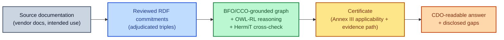

# ARCO

**Assurance & Regulatory Classification Ontology**

ARCO classifies AI systems against EU AI Act Annex III at design time, before deployment. Given a structured RDF description of a system (components, dispositions, intended use, use scenario), the pipeline tells you whether the system satisfies ARCO's formal encoding of Annex III conditions, and exactly why. Same input, same answer, every run. The output is a deterministic OWL entailment over hand-reviewed commitments, not a confidence score and not a legal opinion.

ARCO is an open-source solo learning and research project. It is a research-grade applied ontology and reference pipeline, not a deployable compliance product. Current scope is bounded to EU Regulation 2024/1689 Annex III categories 1(a) (remote biometric identification) and 5(b) (creditworthiness evaluation). The encoded interpretation has not been externally reviewed by qualified counsel or by the EU AI Office. Issues, corrections, and modeling critiques are welcome.

[](https://github.com/Amosk21/ARCO/actions/workflows/arco-demo.yml) [](https://github.com/Amosk21/ARCO/actions/workflows/robot-validate.yml)

---

## TL;DR

- **What.** ARCO tells you whether a structured description of your AI system satisfies ARCO's formal encoding of EU AI Act Annex III conditions, and exactly why, with the entailment chain re-derivable from public axioms.
- **How.** OWL-RL classification over a BFO 2020-grounded ontology (RO, IAO, CCO loaded as ROBOT BOT slim modules), SHACL for documentary completeness, SPARQL ASK on the reasoned graph for audit. HermiT OWL 2 DL cross-check in CI on every push to `main` and every pull request.
- **Run it.** `python 03_TECHNICAL_CORE/scripts/run_pipeline.py` from a fresh clone produces a condition-assessment certificate at `runs/demo/certificate.txt`.

---

## What's modeled

ARCO formally encodes two Annex III categories. A system is classified into a category only when **all three** of these conditions hold for that row:

| Annex III category | The system has a component capable of... | ...and is documented as intended to... | ...affecting... |
|---|---|---|---|
| 1(a) Remote biometric identification | biometric identification | perform remote biometric identification | natural persons |
| 5(b) Creditworthiness evaluation | creditworthiness evaluation | evaluate creditworthiness or assign credit scores | natural persons |

The three conditions are checked formally against the system's RDF description by OWL reasoning. Cross-category isolation (a biometric-only system cannot be classified as creditworthiness, and vice versa) is enforced by the ontology itself, not by hand. A separate precondition flag (`HighRiskSystem`) fires when just the capability is present (column 1 only); that flag is not the full applicability category — the full category needs all three.

---

## How it works (the chain)


```mermaid
flowchart LR
    SRC["Source documentation<br/>(vendor docs, intended use)"]
    --> COMMIT["Reviewed RDF commitments<br/>(adjudicated triples)"]
    --> REASON["BFO/CCO-grounded graph<br/>+ OWL-RL reasoning<br/>+ HermiT cross-check"]
    --> ANSWER["Certificate<br/>(Annex III applicability + evidence path)"]
    --> CDO["CDO-readable answer<br/>+ disclosed gaps"]

    style SRC fill:#cbd5e1,stroke:#475569,color:#0f172a,stroke-width:2px
    style COMMIT fill:#bfdbfe,stroke:#1d4ed8,color:#1e3a8a,stroke-width:2px
    style REASON fill:#bbf7d0,stroke:#15803d,color:#14532d,stroke-width:2px
    style ANSWER fill:#fde68a,stroke:#b45309,color:#78350f,stroke-width:2px
    style CDO fill:#fed7aa,stroke:#c2410c,color:#7c2d12,stroke-width:2px
```

Each arrow is auditable. Source documentation licenses reviewed RDF commitments via an evidence ledger (see `docs/EVIDENCE_TO_COMMITMENT_POLICY.md`). The reasoned graph is verified by `test_gate_removal.py` (each gate is independently necessary) and by HermiT cross-check on certificate-grade fixtures. The certificate's classification line and evidence path are graph-derived; the surrounding pass/fail summary fields are currently Python-composed and are being moved to a graph-bound emitter (see [`LIMITATIONS.md §7.5`](LIMITATIONS.md) and `OPEN_PROBLEMS.md`).

For the ontology structure itself (class hierarchy, three-gate axiom, reality/representation cut, Sentinel walkthrough diagrams), see [`docs/ARCO_technical_overview.md`](docs/ARCO_technical_overview.md).

---

## Sample certificate output

```text
========================================================================
ARCO CONDITION ASSESSMENT CERTIFICATE
========================================================================
  SYSTEM:                  Sentinel_ID_System
  REGIME:                  ARCO ontology encoding of EU AI Act (Article 6 / Annex III)
  PRIMARY ARCO CLASSIFICATION:  AnnexIII1aApplicableSystem (ENTAILED, all three ARCO gates)
  LATENT-RISK FLAG:             HighRiskSystem (Annex III Capability-Precondition Flag;
                                INFERRED via Gate 1 only;
                                not the EU AI Act legal high-risk classification)
  TRIGGERING CAPABILITY:   Sentinel_FaceID_Disposition
  EVIDENCE PATH:
  Sentinel_ID_System -> Sentinel_FaceID_Module -> Sentinel_FaceID_Disposition
  SHACL:                   PASS
  ANNEX III 1(a):          VERIFIED (ENTAILED, Article 6(3) derogation not evaluated)
  ANNEX III 5(b):          NOT APPLICABLE
  ENTAILED TRIPLES ADDED:  +19965

  [exception flags - provider-submitted claims, human review required]
  ART. 6(3) DEROGATION:    NOT FLAGGED
  5(b) FRAUD EXCLUSION:    NOT FLAGGED

  SCOPE: ARCO assesses structured RDF instance data supplied to the pipeline.
         It does not verify raw vendor documentation, the physical deployed
         system, or legal sufficiency. ARCO currently models Annex III 1(a)
         (biometric identification) and 5(b) (creditworthiness) only.
========================================================================
```

The classification result is **derived**, not asserted: removing any gate triple causes the entailment to fail (verified by `test_gate_removal.py`). The reference pipeline writes the certificate, JSON summary, evidence bindings, and SHACL report to `runs/demo/`.

**Output-layer caveat.** The classification line and the evidence path are computed directly from the reasoned graph. Some of the surrounding pass/fail fields are still composed by Python rather than queried from the graph; that is a known bug being worked on. Tracked in [`OPEN_PROBLEMS.md`](OPEN_PROBLEMS.md) and disclosed in [`LIMITATIONS.md §7.5`](LIMITATIONS.md).

---

## What ARCO does NOT do

A real EU AI Act deployment needs more than ARCO currently provides. For each gap, the format is: *what is missing, why an auditor or buyer would want it, why ARCO does not have it yet*.

- **No paper trail back to real source documents.** An auditor signing off on a real determination needs the system's documented intended use to point at specific paragraphs in specific vendor materials (instructions for use, technical documentation, promotional copy, per Article 3(12)). ARCO accepts hand-reviewed RDF describing intended use but does not yet require a citation chain to the source documents. Building that input mile is the next major modeling step; it is queued, not built.
- **No Article 6(3) derogation evaluation.** Article 6(3) lets a provider exit the high-risk label by demonstrating the system does not pose significant risk of harm, subject to four named conditions and a profiling exclusion. A real evaluation needs to assess whether the provider's claim actually meets those conditions. ARCO can detect that a provider has filed a derogation claim and surfaces it for human legal review, but does not judge the claim. That decision requires legal judgment ARCO deliberately does not encode.
- **No prohibition routing under Article 5.** Annex III 1(a) labels biometric identification as high-risk. Article 5(1)(h) goes further: it outright prohibits a specific subset (real-time identification of people in publicly accessible spaces by law enforcement, with narrow exceptions). Any real-world evaluation of a biometric system needs to check whether the deployment falls into that prohibited subset, because the obligations are different from high-risk obligations. ARCO currently treats biometric identification as one category and does not split out the prohibited slice. Adding that distinction is real ontology work, queued.
- **No automatic obligation chain.** Once a system is classified high-risk, the EU AI Act assigns specific duties to providers (Article 16: documentation, post-market monitoring, conformity assessment, and so on) and to deployers (Article 26: instruction-for-use, human oversight, log retention, and so on). A buyer deploying a third-party AI system needs to know which duties attach to which actor. ARCO names the provider and deployer roles in its model but does not yet derive the duty list from a positive classification. This is content work, not architecture.
- **Only two of the eight Annex III categories.** Annex III lists eight high-risk areas; ARCO models two of them. A real deployment evaluation would need its specific category modeled. Adding more categories follows the same three-condition pattern shown above; it is content, not architecture. New categories will be added as worked use cases justify them.
- **No raw document ingestion.** A working compliance product would accept the vendor's PDFs, marketing copy, and technical sheets and produce the structured description ARCO consumes. ARCO does not do that. Turning unstructured documents into a reviewed RDF description is a separate upstream problem (typically LLM-assisted extraction with human review) that ARCO deliberately keeps outside the classification path.

Producing a defensible client-facing determination for a real deployment requires a worked use case grounded in real provider documentation, Article 6(3) derogation evaluation, provider/deployer obligation entailment, and external counsel review. A worked walkthrough comparing ARCO's current certificate to what a defensible determination would say lives in [`docs/REFERENCE_USE_CASE.md`](docs/REFERENCE_USE_CASE.md).

The architectural pattern ARCO demonstrates is reusable. The current scope is bounded. Closing the gap from "reference implementation" to "deployable compliance tool" is a distinct phase of work, not a finishing pass on the current artifact. See [`LIMITATIONS.md`](LIMITATIONS.md) for the full disclosure surface.

---

## Try it

Two ways: run on GitHub (no clone, no install) or run locally.

### Run on GitHub Actions (recommended for a first look)

Go to [Actions → ARCO Demo Run](https://github.com/Amosk21/ARCO/actions/workflows/arco-demo.yml), click **Run workflow** (right side), wait about **3 minutes**, then open the completed run and download the `runs-demo-output` artifact at the bottom. No installation needed.

A note on runtime: the Demo Run uses OWL-RL reasoning and finishes in around 3 minutes. The longer ~25-minute workflow you may see in the Actions tab is `ROBOT Validation`, a separate CI gate that cross-checks classifications against the HermiT OWL 2 DL reasoner. That workflow is a safety net for the project itself; a visitor does not need to trigger it.

**The zip contains, in roughly the order most useful to a reader:**

1. `determination_view.html` — the human-readable visual artifact. Open this first. Dark-themed, shows per-gate Yes/No answers in plain English, expandable Technical Evidence sections with the OWL axiom patterns, and a visual chain like `Sentinel_ID_System → has_part → Sentinel_FaceID_Module → has_disposition → Sentinel_FaceID_Disposition → rdf:type ⊆ AnnexIIITriggeringCapability → OWL-RL ⊢ AnnexIII1aApplicableSystem`.
2. `certificate.txt` — the same result as a structured text certificate.
3. `summary.json` / `determination_packet.json` — structured outputs for machine consumption.
4. `evidence.json` — the evidence-path bindings.
5. `shacl_report.txt` — SHACL conformance result.

**What the artifact accurately reports:** the classification line (whether the system is entailed as Annex III applicable), the evidence path (system → component → disposition), and the SHACL conformance status. These are computed directly from the reasoned graph and are trustworthy.

**What the artifact does NOT yet fully report:** a few of the surrounding pass/fail summary fields are still composed by Python rather than queried from the reasoned graph. Known bug, being worked on. See `LIMITATIONS.md §7.5` and `OPEN_PROBLEMS.md` for the specific fields and the cleanup plan.

### Run locally

Useful if you want to inspect the ontology, modify a fixture, or run the test suite. Light: about 5 MB of repo, about 30 seconds to run. Requirements: Python 3.10 or newer.

```bash
git clone https://github.com/Amosk21/ARCO.git
cd ARCO
python -m venv .venv
source .venv/bin/activate  # Windows PowerShell: .venv\Scripts\Activate.ps1
python -m pip install -r requirements.txt
python 03_TECHNICAL_CORE/scripts/run_pipeline.py
```

Output goes to `runs/demo/`. The same caveat applies to the locally-produced artifacts: classification line and evidence path are graph-derived, surrounding pass/fail fields are under cleanup.

---

## Foundational ontology versions

| Ontology | Version | Loaded as |
|---|---|---|
| **BFO** | BFO 2020 (ISO/IEC 21838-2:2021) | Full ontology, `imports/bfo-2020.owl` |
| **RO** | OBO Relations Ontology release `2025-12-17` | ROBOT BOT slim module |
| **IAO** | Information Artifact Ontology release `2026-03-30` | ROBOT BOT slim module |
| **CCO** | Common Core Ontologies v1.7 (pinned semantic-IRI release) | ROBOT BOT slim module + local bridge declarations |

For the rationale behind ROBOT BOT slim modules over MIREOT or full imports, and the bridge declarations ARCO carries on top, see [`docs/ARCO_imports_rationale.md`](docs/ARCO_imports_rationale.md).

---

## Documentation

| Topic | Document |
|---|---|
| Class hierarchy, gate axioms, walkthrough diagrams | [`docs/ARCO_technical_overview.md`](docs/ARCO_technical_overview.md) |
| OWL vs SHACL vs SPARQL: which layer does what, in ARCO | [`docs/ARCO_three_layers.md`](docs/ARCO_three_layers.md) |
| Why structural-not-behavioral; entailed-triples explanation; active modeling considerations | [`docs/ARCO_design_choices.md`](docs/ARCO_design_choices.md) |
| Why ROBOT BOT slim modules; bridge declarations | [`docs/ARCO_imports_rationale.md`](docs/ARCO_imports_rationale.md) |
| Competency questions and modeling interview flow | [`docs/COMPETENCY_QUESTIONS.md`](docs/COMPETENCY_QUESTIONS.md) |
| Per-commitment modeling workbench | [`docs/MODELING_QUESTION_MAP.md`](docs/MODELING_QUESTION_MAP.md) |
| Current modeling adequacy verdict | [`docs/MODELING_ADEQUACY_BRIEF.md`](docs/MODELING_ADEQUACY_BRIEF.md) |
| Source-to-commitment policy | [`docs/EVIDENCE_TO_COMMITMENT_POLICY.md`](docs/EVIDENCE_TO_COMMITMENT_POLICY.md) |
| Scope cuts and disclosed non-claims | [`LIMITATIONS.md`](LIMITATIONS.md) |
| Active fix register | [`OPEN_PROBLEMS.md`](OPEN_PROBLEMS.md) |
| Worked reference use case (in progress) | [`docs/REFERENCE_USE_CASE.md`](docs/REFERENCE_USE_CASE.md) |
