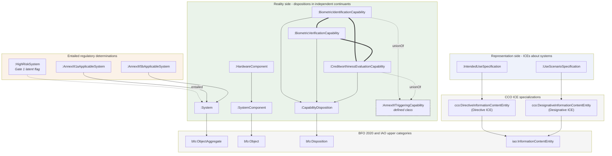
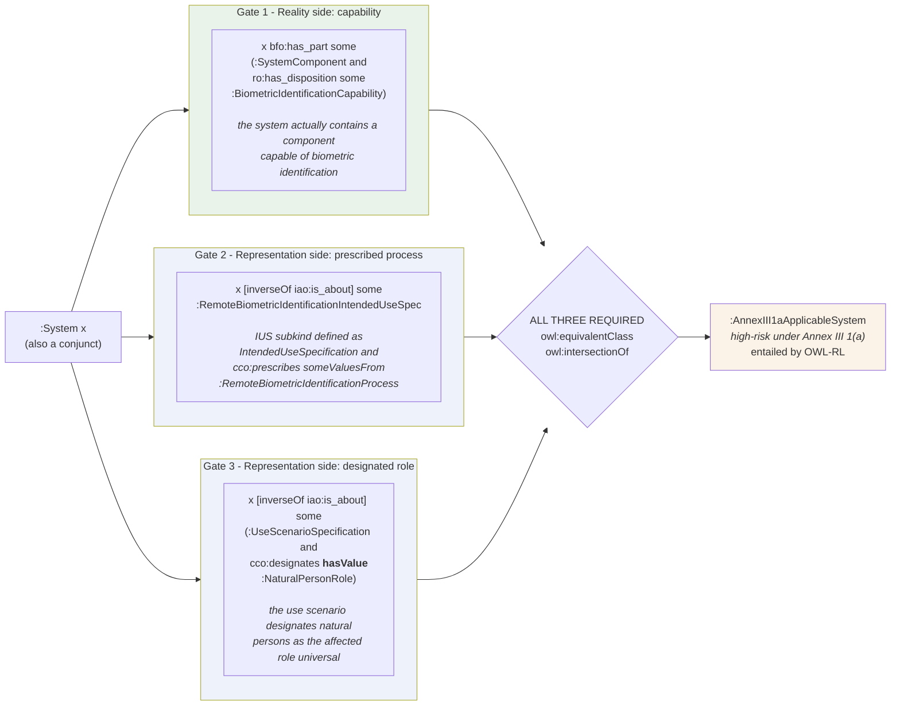
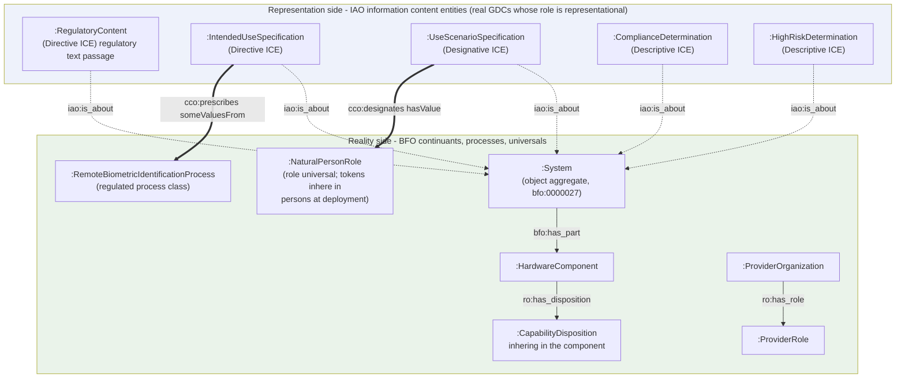
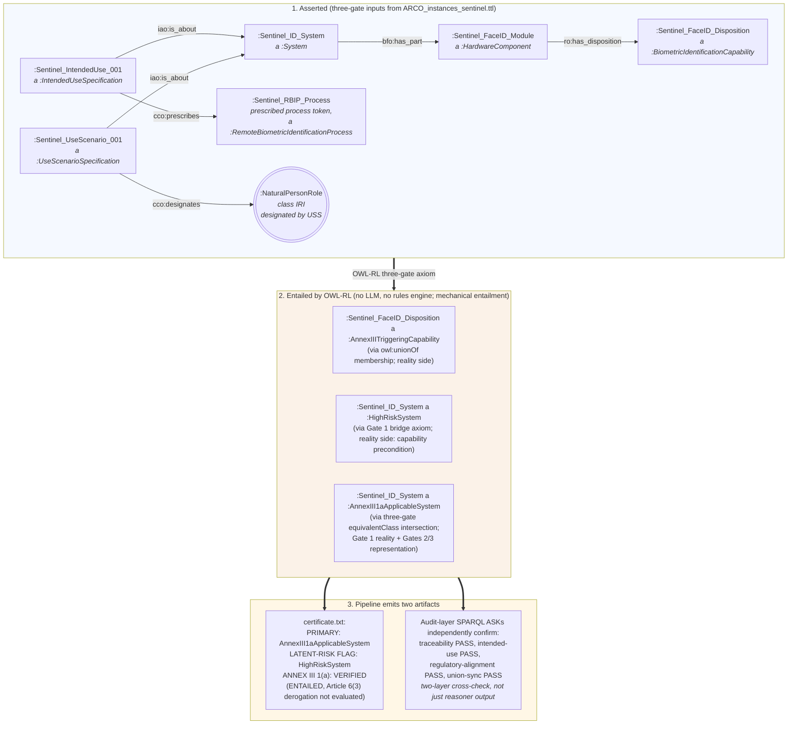

# ARCO Technical Overview

This document holds the structural diagrams and per-axiom captions that explain what ARCO models. The README points here for technical depth; the README itself stays focused on what ARCO does and how to use it.

---

## Class hierarchy at a glance

**Legend.** Solid arrow = `rdfs:subClassOf` (child points to parent, OBO Foundry convention). Dotted arrow labeled `unionOf` = member of the `owl:equivalentClass owl:unionOf` defining `:AnnexIIITriggeringCapability`. Dotted arrow labeled `entailed` = membership entailed via `owl:equivalentClass` intersection rather than asserted as a subclass (`:HighRiskSystem` is the example: not asserted as a subclass of `:System`; entailed when the bridge axiom fires). Thick line `===` = `owl:disjointWith`. `:BiometricVerificationCapability` is intentionally NOT a member of `:AnnexIIITriggeringCapability` because Annex III 1(a) excludes systems intended solely for biometric verification to confirm a claimed identity; Article 3(36) supplies the one-to-one biometric verification definition. The disjointness edges visualize the formal exclusion.

---

## The three-gate axiom (Annex III 1(a))

**Legend.** Green box = reality side (BFO disposition borne by an independent continuant). Blue box = representation side (IAO information content entity describing the system). Gates 2 and 3 use the anonymous inverse-aboutness wrapper `[owl:inverseOf iao:0000136]` so the restriction is on the system itself, not on the spec. Gate 2 uses `owl:someValuesFrom` over a regulated intended-use subkind; the subkind's own `owl:equivalentClass` definition performs the prescribed-process type check. Gate 3 uses `owl:hasValue` against the role universal class IRI (designation by inscription is a documented IAO/CCO pattern; the universal is named directly, not a role-bearer instance). The same shape applies to `:AnnexIII5bApplicableSystem` with `:CreditworthinessEvaluationCapability` / `:CreditworthinessEvaluationIntendedUseSpec` substituted in Gates 1 and 2. **Gate independence is verified by `03_TECHNICAL_CORE/scripts/test_gate_removal.py`**: removing any one of the three triples causes the classification entailment to fail.

**Plain-English read.** ARCO does not legally enforce the EU AI Act; it formalizes a bounded slice of the rule as an OWL defined class. `IUS` means `IntendedUseSpecification`: a reviewed information artifact about a system that prescribes the process the system is intended to realize, not the vendor document itself. Vendor instructions, technical documentation, or source packets license the reviewed RDF commitment that an IUS exists and prescribes a process; the evidence ledger records that licensing step.

**Concretization boundary.** Regulatory text, vendor documentation, intended-use specifications, use-scenario specifications, and ARCO determinations are information content entities that exist in the world by being concretized in documents, files, records, or other bearers. The current ontology models those information artifacts and their aboutness, prescription, and designation relations, not every physical or digital bearer. Full source-document provenance and output provenance are necessary for a defensible application but live outside the three OWL gates in the evidence-to-commitment policy and the output-provenance contract.

---

## The Reality / Representation cut

ARCO commits to a clean separation: dispositions, roles, and processes are real (BFO continuants, occurrents, and universals). Specifications and determinations are information content entities ABOUT the system, not parts of it. The cut is what makes compliance claims inspectable: you can disagree about whether a disposition is present, but you cannot conflate "the documentation says the system has the disposition" with "the system has the disposition."

**Legend.** Solid arrow = reality-side relation (`bfo:has_part`, `ro:has_disposition`, `ro:has_role`). Dotted arrow = reference-style aboutness (`iao:is_about`, used to anchor any ICE to its referent). Thick arrow `==>` = cross-cut constraint with a typed CCO property (`cco:prescribes` typing the prescribed process; `cco:designates` naming the role universal as designation target). Information Content Entities are themselves real entities (generically dependent continuants per BFO 2020); the "Representation side" label denotes their *role in the model* (representing reality) rather than lower ontological status. This matches the realist commitments of the BFO 2020 specification (ISO/IEC 21838-2:2021). The choice to model `:System` as `bfo:ObjectAggregate` rather than as a unitary Object is documented as arguable in [LIMITATIONS.md §3.4](../LIMITATIONS.md).

---

## End-to-end walkthrough: Sentinel test fixture

**Caption.** `Sentinel_ID_System` is the in-repo test fixture, not a real product. The same pipeline runs on any typed instance: `CreditScorer_001` (correctly entailed as `:AnnexIII5bApplicableSystem`), `VerificationKiosk_001` (correctly NOT entailed as Annex III 1(a) because verification is one-to-one and Annex III 1(a) excludes systems intended solely for biometric verification), and the gate-removal regression suite (one triple removed at a time, classification confirmed to fail). The Sentinel fixture intentionally omits provider-side modeling (`ProviderOrganization`, `AssessmentDocumentation`, `DerogationClaim`, etc.) from this view to keep the three-gate trace clear; those instances exist in the same fixture and feed the audit-layer SPARQL ASKs separately. Bearer simplification: `:HardwareComponent` stands in for the configured-system that bears the disposition. For software-configurable AI systems the same hardware can be configured for different modes, so the disposition assertion describes what THIS specific deployment is intended to do under its current commitments, not what the hardware-in-isolation could theoretically do. See [LIMITATIONS.md §3.5](../LIMITATIONS.md).
