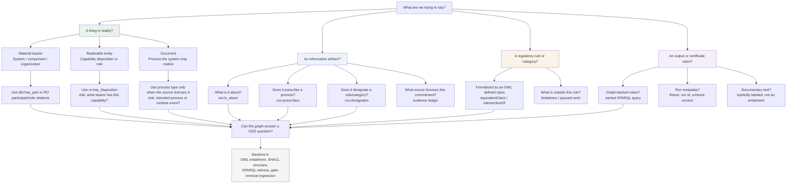

# ARCO Modeling Question Map

This page is the per-commitment workbench for keeping ARCO's graph from becoming decorative. Use it when proposing a new term, triple, source packet, certificate field, or modeling change.

Pair this with [MODELING_ADEQUACY_BRIEF.md](MODELING_ADEQUACY_BRIEF.md): the adequacy brief states what ARCO's current model does and does not justify; this map is the checklist for deciding whether a new commitment belongs in that model. Use [COMPETENCY_QUESTIONS.md](COMPETENCY_QUESTIONS.md) as the CQ0-CQ17 interview script for turning a whole CDO question or new case into answerable requirements.

Boundary between the two files:

- `COMPETENCY_QUESTIONS.md` owns the session-level question: "What must ARCO answer for this system, and what proof chain is required?"
- This file owns the local modeling question: "Given one proposed commitment, what kind of entity is it, what relation may connect it, and what must be refused?"

The rule is simple: first decide what kind of entity the claim is about, then choose the smallest BFO/RO/IAO/CCO relation that says it. A material component can bear a disposition. An intended-use specification can prescribe a process. A use-scenario specification can designate a role universal. A source document can license a reviewed commitment. A certificate field can report an entailment. These are different jobs; mixing them is where the model loses clarity.

## Seven-Bucket Coverage

The seven buckets are the seven structural questions any complete model of a thing must answer. See `CLAUDE.md` § The Seven Buckets (BFO modeling framework) for the canonical definitions. The table below records what ARCO currently asserts in each bucket and what is still gap or scope cut.

| # | Question / Bucket | What ARCO currently uses it for | Status and gap |
|---|---|---|---|
| 1 | **What is it?** Material entities (Independent Continuants) | `:System`, `:SystemComponent`, `:HardwareComponent`, `:ProviderOrganization`, `cco:Person` | **Populated.** Whole-system vs component-level bearer is a documented modeling choice; SaaS/API bearers are out of v1 scope. |
| 2 | **How is it?** Qualities (Specifically Dependent Continuants) | Not yet populated. Inscription qualities on source documents enter here when the kiosk demo gains real source documents. | **Gap.** Slot pattern reserved against `OPEN_PROBLEMS.md` L1.1 (source-derived side) and L2.2 (pipeline-emitted side). |
| 3 | **What can it do?** Realizable entities (function, disposition, role) | `:CapabilityDisposition` and Annex III triggering capability subclasses; `:ProviderRole`, `:DeployerRole`, `:NaturalPersonRole` | **Populated.** Capabilities are modeled as dispositions, not functions; function-level refinement waits for stronger design-intent evidence. `:NaturalPersonRole` referenced as a universal via `cco:designates owl:hasValue`; role-bearer particulars are not minted without source warrant. |
| 4 | **What is happening?** Processes (Occurrents) | Regulated process classes (`:RemoteBiometricIdentificationProcess`, `:BiometricVerificationProcess`, `:CreditworthinessEvaluationProcess`, `:AssessmentDocumentationProcess`) and Gate-2 prescribed process tokens | **Populated as typed tokens.** Bare process tokens are disclosed at `LIMITATIONS.md` §3.7.a (no asserted participants beyond the system, no temporal regions, no realizer chain). Path Gamma remediation queued. |
| 5 | **When and where is it?** Temporal regions and sites | Not modeled in the current Annex III 1(a)/5(b) classifier | **Deliberate scope cut.** A design-time classifier does not need runtime temporal regions; deployment dates, runtime events, places, jurisdiction, and public-space context activate this bucket only if ARCO extends to monitor deployment or substantial modification. Disclosed at `LIMITATIONS.md`. |
| 6 | **How do we know?** Generically Dependent Continuants (Information Content Entities) | `:RegulatoryContent`, `:IntendedUseSpecification`, `:UseScenarioSpecification`, `:AssessmentDocumentation`, `:ComplianceDetermination`, `:HighRiskDetermination`, regulator-defined `:AnnexIII_Condition_*` and `:AnnexIII1aApplicableSystem` classes | **Populated as typed ICE instances and regulator-defined classes.** Concretization back to bearer particulars (which inscription on which document) is the realist gap that L1.1 and L2.2 close together. |
| 7 | **What grounds the risk or capability?** Material basis and realization | `bfo:0000055` (realizes) and `ro:0000091` (has_disposition) committing a hardware component bears the disposition | **Partial.** The deeper chain (what specifically physically grounds the disposition, how the realization process unfolds, what licenses the inference that a borne disposition will be realized in a particular process kind) is not yet load-bearing. Deeper realization modeling queued behind Path Gamma and the kiosk demo's real-document warrant. |

## How To Use This Map

Before adding a modeling commitment, answer four questions:

1. Which of the seven buckets does the entity belong to (which of the seven questions does it answer)?
2. Which BFO/RO/IAO/CCO relation connects it to the rest of the graph?
3. What source or reviewed commitment licenses the assertion?
4. What test, query, shape, or limitation would catch the mistake if the assertion is wrong?

If a proposed change does not answer those questions, it should stay out of the ontology until the modeling decision is clearer.

## Hard Questions Requiring Human Review

These are not routine implementation tasks. They are modeling decisions where ARCO needs explicit human judgment before the graph should change.

| Question | Why it matters | Current posture |
|----------|----------------|-----------------|
| Should Gate 2 reference process tokens or prescribed process kinds? | Bare process tokens can look like fake occurrent witnesses if the source only licenses intended use. | Held in `OPEN_PROBLEMS.md` L2.1. |
| Which ICEs need explicit concretizing bearers? | Concretization matters for output trust, but modeling every bearer can bloat the graph. | `cco:is_tokenized_by` is tracked in `OPEN_PROBLEMS.md` L2.2. |
| When is verification formally disjoint from identification at the process level? | Capability disjointness exists; process disjointness may be needed for the kiosk negative case to be visually and formally crisp. | Hold until a test or fixture makes it load-bearing. |
| Are provider and deployer roles disjoint? | One organization can bear different roles for different systems; disjointness must apply to role instances, not organizations. | Human-session question. |
| How should cloud/SaaS systems be represented as material bearers? | Current `:System` mereology assumes material components and can force fictional parts for pure SaaS. | Active modeling consideration in `README.md`. |
| When does Annex III 1(a) branch to Article 5 prohibited-practice routing? | Real-time RBI in public law-enforcement contexts needs site, actor, and purpose modeling that v1 lacks. | Disclosed scope gap. |
| What source evidence is enough to assert a disposition? | Documents license commitments; they do not become reality by themselves. | Evidence-ledger demo is the next proof move. |
| For each certificate field, what is the provenance class? | Graph-backed, run metadata, and documentary text must not be visually merged. | Output manifest v2 governs this. |

Use this table as the starting agenda for human-in-the-loop modeling sessions. Do not turn these into code changes just because they are written down.
