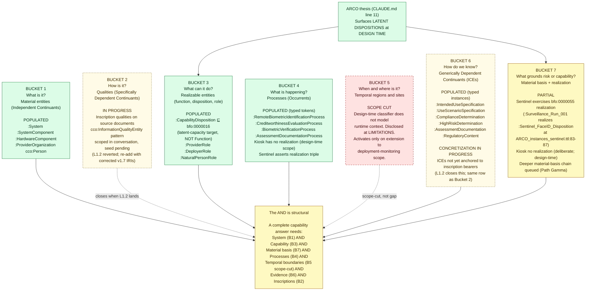

# Seven Buckets Status — What ARCO Populates and What It Refuses to Claim

## Purpose

The Seven Buckets framework at `CLAUDE.md` § The Seven Buckets is the structural completeness check for ARCO's modeling. Each bucket is a question any complete model of a thing must answer; failing to populate (or to honestly disclose a scope cut on) any bucket means a missing structural piece. This diagram records what ARCO currently populates, what is in progress, and what is deliberately scope-cut, with citations.

## Diagram

## Status legend

- **POPULATED** (green) — the bucket has instance commitments in the running graph; the pipeline exercises them; the entailment or audit they support fires.
- **IN PROGRESS** (yellow dashed) — the modeling decision is locked, the canon-grounding is verified, the design is in conversation, but the code or seed-list expansion has not yet committed. The bucket has the slot but not the instances.
- **PARTIAL** (yellow solid) — the bucket has some instance commitments but is not fully exercised; some structural pieces remain queued.
- **SCOPE CUT** (red dashed) — deliberately not modeled at current scope; disclosed in `LIMITATIONS.md` with rationale; would mis-extend ARCO's design-time framing to model.

## Verification table

| Bucket | Status | Verified against | OPEN_PROBLEMS reference |
|---|---|---|---|
| 1. Material entities | POPULATED | `ARCO_core.ttl:58-82`, `ARCO_governance_extension.ttl:45-64, 144-150`; `cco:Person` and `cco:Organization` at `cco_seed.txt:1, 8` | none |
| 2. Qualities (SDC) | IN PROGRESS | Pattern verified at CCO v1.7 `cco:InformationQualityEntity` (canonical IRI); seeds NOT in current `cco_seed.txt` (8 entries); L1.2 row reverted | L1.1 (ledger), L1.2 (reverted, planned for re-add) |
| 3. Realizable entities | POPULATED | `ARCO_core.ttl:84-105`; `:NaturalPersonRole` at `ARCO_governance_extension.ttl:323-327`; Disposition not Function per BFO 2020 [064-001] (canonical line at `bfo-2020.owl:1326-1327`); X.11 rationale-comment fix landed at `ARCO_core.ttl:26-38`; component-level bearer rationale at `LIMITATIONS.md §3.5` (three-stacked: traceability, hardware-software amalgam simplification, software-configurable deployment scope); see `decisions_justification_map.md` entries F2, S2 for the full justification map | none — Disposition framing locked per X.11 verdict |
| 4. Processes | POPULATED | `ARCO_governance_extension.ttl:290-321`; Sentinel realization at `ARCO_instances_sentinel.ttl:83-87`; kiosk has no realization (design-time scope) | L2.1 (bare token disclosure, DISCLOSED+BLOCKED) |
| 5. Temporal/site | SCOPE CUT | Disclosed at `LIMITATIONS.md` (design-time framing) | none — deliberate cut |
| 6. ICEs | POPULATED as typed; CONCRETIZATION IN PROGRESS | `ARCO_core.ttl:137-152`, `ARCO_governance_extension.ttl:113-130, 233-333`; concretization triples to bearer particulars not yet asserted on any fixture | L2.2 (`cco:is_tokenized_by`), L1.2 (kiosk concretization, reverted) |
| 7. Material basis + realization | PARTIAL | `ARCO_instances_sentinel.ttl:83-87` exercises `bfo:0000055`; kiosk omits by scope; deeper material-basis chain queued | Path Gamma (no explicit row yet; X.11 finding 5 queued as architectural redesign) |

## Notes on the THESIS arrow

The thesis (`CLAUDE.md` line 11) names latent dispositions at design time as ARCO's value proposition. The diagram links the thesis to Bucket 3 (the disposition class) and Bucket 7 (the material basis grounding the latent capacity). Both are load-bearing for the value claim. The X.11 review's finding 1 — proposed re-typing `:CapabilityDisposition` as `bfo:0000034 Function` — was verified WRONG; Disposition is the correct parent for the latent-capability target, because Function would narrow ARCO out of the latent case.

## What this diagram does NOT show

- Class hierarchies under each bucket (e.g., the full subclass tree from `bfo:0000023 Role` to `:ProviderRole` and `:NaturalPersonRole`). See `value_chain.md` and the ARCO_core / ARCO_governance_extension files for those.
- The OWL axiom shape of the three-gate classifier. See `three_gate_classifier.md`.
- The CDO question / certificate value chain. See `value_chain.md`.
- Fixture-by-fixture coverage. The verification table cites Sentinel and Kiosk specifically; fuller fixture coverage lives in the eventual `fixtures_map.md` (not yet authored).
- Accountability-to-individual extension. Queued in conversation, no OPEN_PROBLEMS row yet, not currently in any bucket's populated state.

## When to update

- Bucket 2 / Bucket 6 concretization transitions to POPULATED when L1.2 re-lands in `OPEN_PROBLEMS.md` and the inscription work commits.
- Bucket 5 transitions out of SCOPE CUT only if ARCO extends to monitor-deployment scope; if so, this whole diagram needs revising.
- Bucket 7 transitions from PARTIAL to POPULATED when the deeper material-basis chain (Path Gamma or its successor) commits.
- The X.11 verdict on the Disposition / Function question is locked; revisit only if a future BFO 2020 release changes the Function elucidation in `bfo-2020.owl`.
