# Three-Gate Classifier: OWL Axiom Shape and PRIMARY / LATENT-RISK Bifurcation

## Purpose

Annex III applicability in ARCO is entailed (not pattern-matched) when three gates hold. The three gates and their OWL axiom shape are what makes ARCO a classifier rather than a search engine. This diagram shows how the gates compose into the two category-specific applicability classes and how they bifurcate from the Gate-1-only latent-risk flag. Each axiom branch is cited to the file and line that declares it.

## Diagram

```mermaid
flowchart TB
  classDef gate fill:#fef9c3,stroke:#a16207,color:#3f2a00
  classDef class1a fill:#dbeafe,stroke:#1e40af,color:#0c1e4f
  classDef class5b fill:#e0e7ff,stroke:#4338ca,color:#1e1b4b
  classDef latent fill:#fef3c7,stroke:#92400e,color:#451a03
  classDef triggering fill:#dcfce7,stroke:#15803d,color:#052e16
  classDef positive fill:#bbf7d0,stroke:#166534,color:#052e16
  classDef negative fill:#fee2e2,stroke:#b91c1c,color:#450a0a
  classDef output fill:#fce7f3,stroke:#9d174d,color:#3b0827

  SYS[":System root class<br/>ARCO_core.ttl:98"]:::triggering

  G1_GENERIC["Gate 1 GENERIC (Latent flag)<br/>System bfo:0000051 (has_part) Component<br/>AND Component ro:0000091 (has_disposition) AnnexIIITriggeringCapability<br/>ARCO_governance_extension.ttl:241-266"]:::gate

  G1_1a["Gate 1 specific to 1(a)<br/>has_disposition some :BiometricIdentificationCapability<br/>ARCO_governance_extension.ttl:509-521"]:::gate

  G1_5b["Gate 1 specific to 5(b)<br/>has_disposition some :CreditworthinessEvaluationCapability<br/>ARCO_governance_extension.ttl:599-611"]:::gate

  G2_1a["Gate 2 specific to 1(a)<br/>some IUS inverse iao:0000136 the System<br/>AND IUS is a :RemoteBiometricIdentificationIntendedUseSpec<br/>(class-level cco:prescribes someValuesFrom :RemoteBiometricIdentificationProcess)<br/>ARCO_governance_extension.ttl:522-532, 294-307"]:::gate

  G2_5b["Gate 2 specific to 5(b)<br/>some IUS inverse iao:0000136 the System<br/>AND IUS is a :CreditworthinessEvaluationIntendedUseSpec<br/>(class-level cco:prescribes someValuesFrom :CreditworthinessEvaluationProcess)<br/>ARCO_governance_extension.ttl:612-621, 309-322"]:::gate

  G3["Gate 3 (shared by 1a and 5b)<br/>some USS inverse iao:0000136 the System<br/>AND USS cco:designates owl:hasValue :NaturalPersonRole<br/>ARCO_governance_extension.ttl:534-554, 623-639"]:::gate

  TRIG[":AnnexIIITriggeringCapability<br/>(regulatory fiat partition)<br/>owl:equivalentClass owl:unionOf<br/>(:BiometricIdentificationCapability :CreditworthinessEvaluationCapability)<br/>ARCO_governance_extension.ttl:219-232"]:::triggering

  CLS_1a[":AnnexIII1aApplicableSystem<br/>(defined class, all three 1(a) gates)<br/>ARCO_governance_extension.ttl:490-556"]:::class1a

  CLS_5b[":AnnexIII5bApplicableSystem<br/>(defined class, all three 5(b) gates)<br/>ARCO_governance_extension.ttl:579-641"]:::class5b

  HRS[":HighRiskSystem<br/>(latent flag, Gate 1 generic only)<br/>NOT the legal high-risk category<br/>ARCO_governance_extension.ttl:241-266"]:::latent

  PRI_OUT["PRIMARY ARCO classification<br/>(category-specific applicability)<br/>certificate field: primary_arco_classification<br/>schema 1.3"]:::output

  LAT_OUT["LATENT-RISK FLAG<br/>(any triggering capability borne, Gate 1 only)<br/>certificate field: latent_risk_class<br/>schema 1.3"]:::output

  F_SENT["Fixture: Sentinel<br/>POSITIVE 1(a)<br/>ARCO_instances_sentinel.ttl"]:::positive
  F_CRED["Fixture: CreditScorer<br/>POSITIVE 5(b)<br/>ARCO_instances_creditscoring.ttl"]:::positive
  F_KIOSK["Fixture: Verification Kiosk<br/>NEGATIVE 1(a)<br/>:BiometricVerificationCapability NOT in AnnexIIITriggeringCapability union<br/>ARCO_instances_verification.ttl"]:::negative
  F_FLAG["Fixture: flag_tests<br/>tests latent flag fires correctly on triggering capabilities<br/>ARCO_instances_flag_tests.ttl"]:::positive
  F_DECOY["Fixture: adversarial decoy / blanknode<br/>tests reasoner robustness<br/>ARCO_instances_adversarial_*.ttl"]:::negative

  SYS --> G1_GENERIC
  SYS --> G1_1a
  SYS --> G1_5b

  G1_GENERIC -.->|"references AnnexIIITriggeringCapability union"| TRIG
  G1_1a -.->|"specific triggering subclass"| TRIG
  G1_5b -.->|"specific triggering subclass"| TRIG

  G1_GENERIC --> HRS

  G1_1a --> CLS_1a
  G2_1a --> CLS_1a
  G3 --> CLS_1a

  G1_5b --> CLS_5b
  G2_5b --> CLS_5b
  G3 --> CLS_5b

  CLS_1a --> PRI_OUT
  CLS_5b --> PRI_OUT
  HRS --> LAT_OUT

  F_SENT -.->|"all three 1(a) gates"| CLS_1a
  F_CRED -.->|"all three 5(b) gates"| CLS_5b
  F_KIOSK -.->|"Gate 1 fails: verification not in triggering union"| CLS_1a
  F_KIOSK -.->|"latent flag does not fire either"| HRS
  F_FLAG -.->|"latent flag fires"| HRS
  F_DECOY -.->|"various negative tests"| CLS_1a
```

## Axiom shape, plain English

For a system to be entailed as `:AnnexIII1aApplicableSystem`, OWL-RL needs the conjunction of three things to hold on that system:

**Gate 1 (reality side):** the system has a part (a `:SystemComponent`) that bears a disposition typed as `:BiometricIdentificationCapability`. The relation is `bfo:0000051` (has_part) from System to Component and `ro:0000091` (has_disposition) from Component to the disposition.

**Gate 2 (representation side):** there exists an `:IntendedUseSpecification` instance whose `iao:0000136` (is_about) target is the system, AND that instance is typed as the defined class `:RemoteBiometricIdentificationIntendedUseSpec`. That subkind is itself a defined class whose membership requires `cco:prescribes someValuesFrom :RemoteBiometricIdentificationProcess`. Putting the type-check on the IUS subkind avoids the bare-token problem; an IUS is classified as the regulated subkind only if it prescribes a particular of the regulated process kind.

**Gate 3 (representation side):** there exists a `:UseScenarioSpecification` instance whose `iao:0000136` (is_about) target is the system, AND that USS asserts `cco:designates :NaturalPersonRole` via `owl:hasValue`. The filler is the class IRI used as a named individual (OWL 2 punning, legal under the DL profile; the entailment consumes the IRI only in its individual interpretation). This designates the role category without minting a bearer-less role particular; treating the punned individual as standing for the category is ARCO's documented modeling intent, not a CCO-documented use.

For Annex III 5(b), Gate 1 swaps the capability class to `:CreditworthinessEvaluationCapability`; Gate 2 swaps the IUS subkind to `:CreditworthinessEvaluationIntendedUseSpec` and the prescribed process to `:CreditworthinessEvaluationProcess`; Gate 3 is unchanged (same designative-role pattern).

## Two distinct outputs, two distinct entailments

The certificate carries TWO distinct classification claims. They are not the same thing and the bifurcation is load-bearing.

**PRIMARY ARCO classification** is the category-specific applicability: `:AnnexIII1aApplicableSystem` or `:AnnexIII5bApplicableSystem`, entailed only when all three gates hold. This is the operative determination an auditor or regulator would treat as the answer to "is this system Annex III applicable under this category?"

**LATENT-RISK FLAG** is `:HighRiskSystem` membership, entailed by Gate 1 alone: the system has a part bearing some triggering capability. This is the looser, capability-only signal. It fires on any system whose hardware bears identification OR creditworthiness capability, regardless of whether the intended-use or use-scenario gates are satisfied. The latent flag is NOT the legal high-risk classification; it is a "look harder here" signal grounded in the latent-disposition target ARCO names in its thesis.

The bifurcation matters because Gate 1 is reality-side (the hardware physically grounds the capability) and Gates 2 and 3 are representation-side (provider intent and use scenario). ARCO's stated target is to surface latent dispositions at design time: Gate 1 alone surfaces the latent capability. Gates 2 and 3 carry the conditions the regulation keys on (documented intended use of a regulated process kind; affected natural persons); Gate 1 is ARCO's added design-time evidential gate, stricter than the Annex III text. The encoding therefore has a disclosed under-classification direction: a description with documented regulated intent but no asserted capability commitment is not entailed (see LIMITATIONS §3.9).

## Verification table

| Axiom or class | File and lines | Note |
|---|---|---|
| `:AnnexIII1aApplicableSystem` (full defined class) | `03_TECHNICAL_CORE/ontology/ARCO_governance_extension.ttl:490-556` | Three gates via `owl:intersectionOf` with `owl:equivalentClass` |
| `:AnnexIII5bApplicableSystem` (full defined class) | `03_TECHNICAL_CORE/ontology/ARCO_governance_extension.ttl:579-641` | Same shape as 1(a) with category-specific subclasses |
| `:HighRiskSystem` (latent flag, Gate 1 generic only) | `03_TECHNICAL_CORE/ontology/ARCO_governance_extension.ttl:241-266` | `owl:equivalentClass owl:intersectionOf` over `:System` and Gate-1-generic component restriction |
| `:AnnexIIITriggeringCapability` (regulatory fiat union) | `03_TECHNICAL_CORE/ontology/ARCO_governance_extension.ttl:219-232` | Defined class via `owl:unionOf` over named member capability classes |
| `:BiometricIdentificationCapability` | `03_TECHNICAL_CORE/ontology/ARCO_core.ttl:129-133` | In triggering union; 1:N |
| `:BiometricVerificationCapability` | `03_TECHNICAL_CORE/ontology/ARCO_core.ttl:135-139` | NOT in triggering union; 1:1 (why kiosk fixture is negative) |
| `:CreditworthinessEvaluationCapability` | `03_TECHNICAL_CORE/ontology/ARCO_core.ttl:141-145` | In triggering union |
| `:RemoteBiometricIdentificationIntendedUseSpec` (Gate 2 1(a) IUS subkind) | `03_TECHNICAL_CORE/ontology/ARCO_governance_extension.ttl:294-307` | `owl:equivalentClass` with `cco:prescribes someValuesFrom :RemoteBiometricIdentificationProcess` |
| `:CreditworthinessEvaluationIntendedUseSpec` (Gate 2 5(b) IUS subkind) | `03_TECHNICAL_CORE/ontology/ARCO_governance_extension.ttl:309-322` | Same shape, category-specific |
| Gate 3 `cco:designates owl:hasValue :NaturalPersonRole` pattern | `03_TECHNICAL_CORE/ontology/ARCO_governance_extension.ttl:534-554, 623-639` | Avoids bearer-less role token per `LIMITATIONS.md` §3.1 |
| `:NaturalPersonRole` | `03_TECHNICAL_CORE/ontology/ARCO_governance_extension.ttl:408-412` | `cco:designates owl:hasValue` references the universal; no bearer particulars minted (L2.4 DISCLOSED) |

| Fixture | OWL outcome under three-gate axiom | File |
|---|---|---|
| Sentinel | `:AnnexIII1aApplicableSystem` entailed (positive 1(a)) | `ARCO_instances_sentinel.ttl` |
| CreditScorer | `:AnnexIII5bApplicableSystem` entailed (positive 5(b)) | `ARCO_instances_creditscoring.ttl` |
| Verification Kiosk | Neither applicable class entailed; `:HighRiskSystem` does not fire either (verification capability is NOT in the triggering union) | `ARCO_instances_verification.ttl` |
| flag_tests | Tests latent flag fires correctly when a triggering capability is borne | `ARCO_instances_flag_tests.ttl` |
| adversarial_blanknode / adversarial_decoy | Tests reasoner robustness against malformed or misleading input | `ARCO_instances_adversarial_*.ttl` |

## Why the disposition-not-function choice matters here

The three-gate axiom uses `:Capability` (subclass of `bfo:0000016`) for the capability conjunct. If `:Capability` were instead typed under `bfo:0000034 (Function)`, Gate 1 would narrow to designed-for capabilities and exclude latent capacities that the hardware grounds without explicit design intent. Disposition is the correct parent class for the latent-capacity target ARCO surfaces; the rationale comment at `ARCO_core.ttl:28-40` cites the BFO 2020 [064-001] Function elucidation directly.

## What this diagram does NOT show

- The full `owl:intersectionOf` RDF serialization. The diagram describes the conjunction; the actual axiom triples are at the cited lines.
- Pre-reasoning vs post-reasoning state. The defined classes fire entailment; SPARQL queries audit the closed graph. See `value_chain.md` for the reasoner + audit layer.
- Article 6(3) derogation. Provider-submitted claim that the system "does not pose a significant risk of harm"; ARCO surfaces the `:DerogationClaim` ICE but does not evaluate validity. Disclosed at `LIMITATIONS.md`; out of OWL gate scope.
- Article 5 (prohibited practices) routing. Out of v1 scope; future work.
- The mapping from gates to specific Annex III text. Annex III 1(a) and 5(b) are the only two categories currently encoded; future Annex III categories would extend `:AnnexIIITriggeringCapability` via `owl:unionOf` (the regulatory scaffold pattern).

## When to update

- A new Annex III category lands (e.g., 1(b), 1(c), or any of Annex III points 2-8). Add to `:AnnexIIITriggeringCapability` union per Invariant 8, extend the diagram with the new category-specific class.
- The bare-token modeling pattern is refactored (disclosed at `LIMITATIONS.md §3.7.a`, queued behind Path Gamma). Update the Gate 2 description.
- Article 5 or Article 6(3) modeling enters scope. Add the corresponding entailment branch.
- The PRIMARY / LATENT-RISK FLAG output split is refactored. Update the certificate-output node and possibly the `:HighRiskDetermination` class.
- Any cited line number shifts due to a file edit. Re-verify and update.
