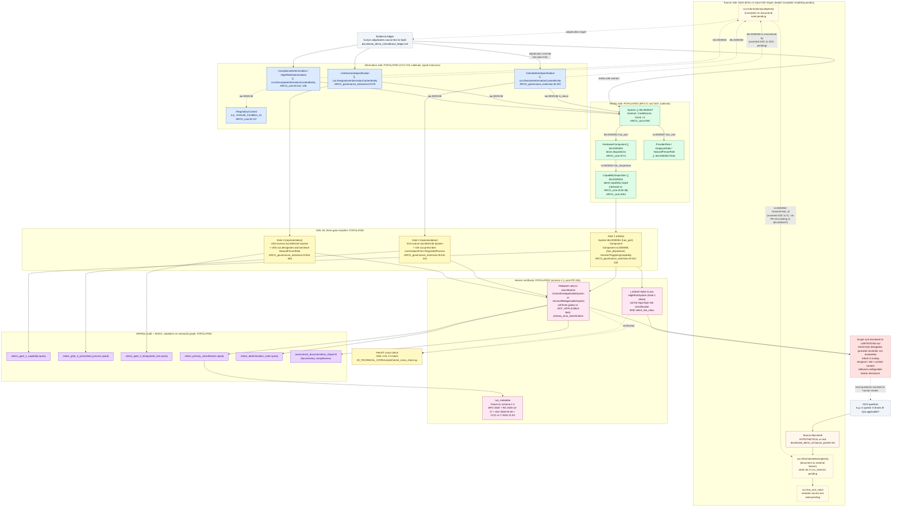

# Value Chain: Source Document to Honest Certificate

## Purpose

This diagram shows the end-to-end chain ARCO names as its target: source documentation, reviewed RDF commitments, BFO/CCO-aligned graph, reasoner entailment, inspectable answer, honest certificate. Every node traces to the file that grounds it; every edge traces to the BFO/CCO/RO/IAO predicate that connects it.

## Diagram

## Verification table

Every node above traces to a file. Every edge traces to a BFO/CCO/RO/IAO/ARCO axiom or declaration.

| Diagram node | What it is | Where it's defined |
|---|---|---|
| `:System` | The assessment target class | `03_TECHNICAL_CORE/ontology/ARCO_core.ttl:58-66` |
| `:HardwareComponent` | Material component bearing dispositions | `03_TECHNICAL_CORE/ontology/ARCO_core.ttl:74-82` |
| `:CapabilityDisposition` | Latent-capability target class | `03_TECHNICAL_CORE/ontology/ARCO_core.ttl:84-87` |
| `:IntendedUseSpecification` | Directive ICE class | `03_TECHNICAL_CORE/ontology/ARCO_governance_extension.ttl:233-247` |
| `:UseScenarioSpecification` | Designative ICE class | `03_TECHNICAL_CORE/ontology/ARCO_governance_extension.ttl:279-288` |
| `:ComplianceDetermination` | Descriptive ICE (entailment record) | `03_TECHNICAL_CORE/ontology/ARCO_core.ttl:142-146` |
| `:HighRiskDetermination` | Descriptive ICE (Gate-1 latent or three-gate applicability record) | `03_TECHNICAL_CORE/ontology/ARCO_core.ttl:148-152` |
| `:RegulatoryContent` | Directive ICE for regulatory text | `03_TECHNICAL_CORE/ontology/ARCO_core.ttl:137-140` |
| `:AnnexIII1aApplicableSystem` | Three-gate defined class for Annex III 1(a) | `03_TECHNICAL_CORE/ontology/ARCO_governance_extension.ttl:405-468` |
| `:AnnexIII5bApplicableSystem` | Three-gate defined class for Annex III 5(b) | `03_TECHNICAL_CORE/ontology/ARCO_governance_extension.ttl:491-550` |
| `:HighRiskSystem` | Gate-1-only latent-risk flag class | `03_TECHNICAL_CORE/ontology/ARCO_governance_extension.ttl:199-221` |
| `cco:InformationBearingEntity` (pending) | Document material bearer class | CCO v1.7 (canonical IRI; not yet in `cco_seed.txt`) |
| `cco:InformationQualityEntity` (pending) | Inscription quality class | CCO v1.7 (canonical IRI; not yet in `cco_seed.txt`) |
| `cco:has_text_value` (pending) | Verbatim text predicate | CCO v1.7 line 437-442 in `runs/scratch/cco-v1.7/CommonCoreOntologiesMerged.ttl`; not yet in `cco_seed.txt` |

| Diagram edge | Relation IRI | Where it's defined |
|---|---|---|
| Inscription inheres in document (asserted IQE to IBE) | `ro:0000052` (characteristic_of) | `03_TECHNICAL_CORE/ontology/imports/ro_bot.owl:534-549` plus ARCO binding `ro:0000052 rdfs:subPropertyOf bfo:0000197` at `ARCO_core.ttl:193-194` (PR #41). Asserted-subject: IQE (SDC); asserted-object: IBE (IC). Inverse `ro:0000053` (bearer_of) materializes via OWL-RL prp-inv1. |
| ICE is concretized by inscription (asserted ICE to IQE) | `bfo:0000058` (is concretized by) | `03_TECHNICAL_CORE/ontology/imports/bfo-2020.owl:225-241`. Asserted-subject: ICE (GDC); asserted-object: IQE (SDC). Domain BFO_0000031 (GDC); range union of BFO_0000015 (Process) and BFO_0000020 (SDC). Inverse `bfo:0000059` (concretizes) materializes via OWL-RL prp-inv1. |
| System has component | `bfo:0000051` (has_part) | `03_TECHNICAL_CORE/ontology/imports/bfo-2020.owl` |
| Component has disposition | `ro:0000091` (has_disposition) | `03_TECHNICAL_CORE/ontology/imports/ro_bot.owl:712+` |
| Bearer has role | `ro:0000087` (has_role) | `03_TECHNICAL_CORE/ontology/imports/ro_bot.owl:696-708` |
| ICE is about system | `iao:0000136` (is_about) | `03_TECHNICAL_CORE/ontology/imports/iao_bot.owl` |
| IUS prescribes process | `cco:prescribes` | `03_TECHNICAL_CORE/ontology/ARCO_governance_extension.ttl:132-134` |
| USS designates role | `cco:designates` | `03_TECHNICAL_CORE/ontology/ARCO_governance_extension.ttl:136-139` |

## Status notes

**POPULATED nodes** are present in the current graph and exercised by the pipeline. The reality side, information side, three-gate classifier, audit layer, and certificate output all qualify.

**PENDING nodes** (the source-side subgraph: IBE / IQE / TXT, plus the concretization edges to ICEs) are scoped and canon-verified, but the seeds are not in `cco_seed.txt` and the work is not in the active register today. The kiosk demo v1 holds the input-mile shape with a hypothetical source packet; deeper inscription modeling is conditional on real-document warrant. Current work sequence prioritizes the foundation modeling map (per `docs/CANON_BACKTEST_2026-05-12.md` §F.1) before the kiosk demo substitution and before the inscription seed re-add.

**SCOPE CUT** (the `SCOPE` node at the bottom right) names the things ARCO deliberately refuses to claim under current commitments. These appear in `LIMITATIONS.md` with rationale. Key items:

- Article 6(3) derogation: ARCO surfaces `:DerogationClaim` ICEs for human legal review but does not evaluate validity.
- Article 5 routing (prohibited-practice classification): out of v1 scope; future work.
- Temporal regions, sites, runtime context: design-time classifier only.
- Software-configurable hardware capability: OWA-bounded; ARCO does not assert hardware-incapability.

## What this diagram does NOT show

- The full RO / IAO / BFO / CCO import chain. The slim modules at `03_TECHNICAL_CORE/ontology/imports/*.owl` provide everything the diagram cites. See `docs/ARCO_imports_rationale.md` for the import-chain discussion.
- Fixture-specific data. The 6 fixtures (Sentinel, CreditScorer, Verification, flag_tests, adversarial_blanknode, adversarial_decoy) instantiate the reality and information sides for specific systems. See `three_gate_classifier.md` for which fixture exercises which gate combination.
- The accountability-to-individual extension (canon-grounded in conversation; activates when a specific use case demands named-individual chain).
- The CCO version provenance hardening (the version pin lives in `ARCO_governance_extension.ttl:15` comment, not in `cco_bot.owl` itself).

## When to update

- Kiosk demo v1 substitutes a real vendor document for the current hypothetical source packet: revise the SRC subgraph to reflect the populated input-mile chain.
- Inscription seed work is re-prioritized and committed to `cco_seed.txt` and a fixture: change the PENDING subgraph status to POPULATED and remove the "seed pending" labels.
- A new Annex III category enters ARCO: extend the classifier subgraph and the `:AnnexIIITriggeringCapability` membership commentary.
- The certificate schema bumps past 1.3: update the schema reference in the `META` and `PRI` nodes.
- A new SHACL shape lands: add it to the AUDIT subgraph.
- The accountability-to-individual layer activates: extend the reality side with a Person + Role chain.
- Any of the version pins (BFO / RO / IAO / CCO) advances: update the `META` node and re-verify all cited line numbers.
